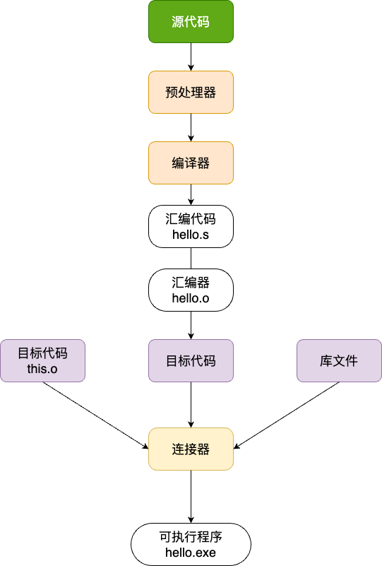

**C 语言示例:**

```c
// hello.c

#include <stdio.h>

int main(void)
{
  printf("Hello China");
  return 0;
}
```

想将此 C 语言代码编译成可执行文件, 需要经过：

- 预处理(Preprocessing)
- 编译(Compilation)
- 汇编(Assemble)
- 链接(Linking)




在 Linux 环境中如果安装 GCC 编译器, 会看到在程序中存在各种二进制文件

- cpp：预处理器
- ccl：编译器
- as：汇编器
- ld：连接器
- ar：静态库制作工具