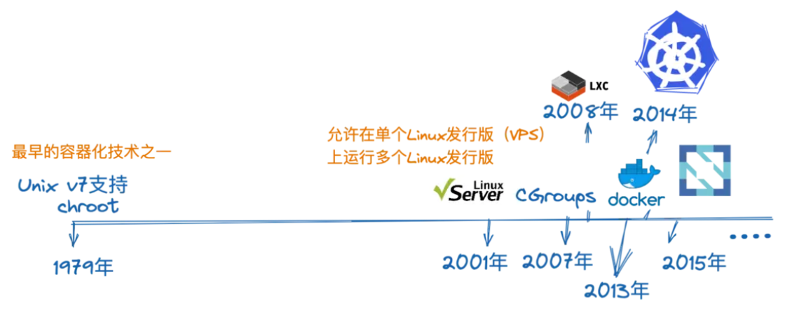
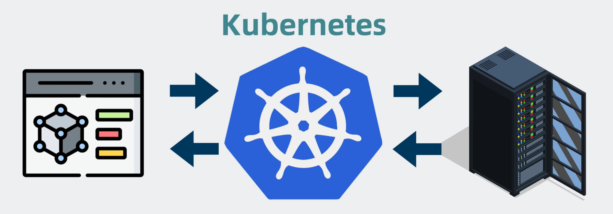
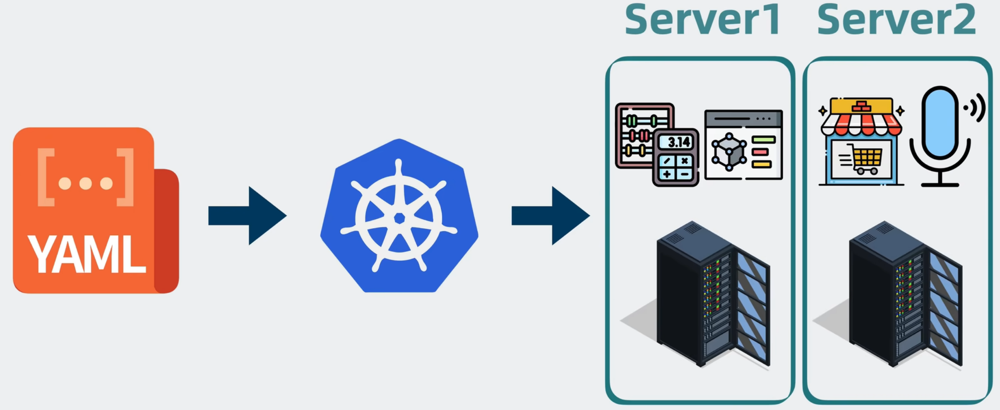
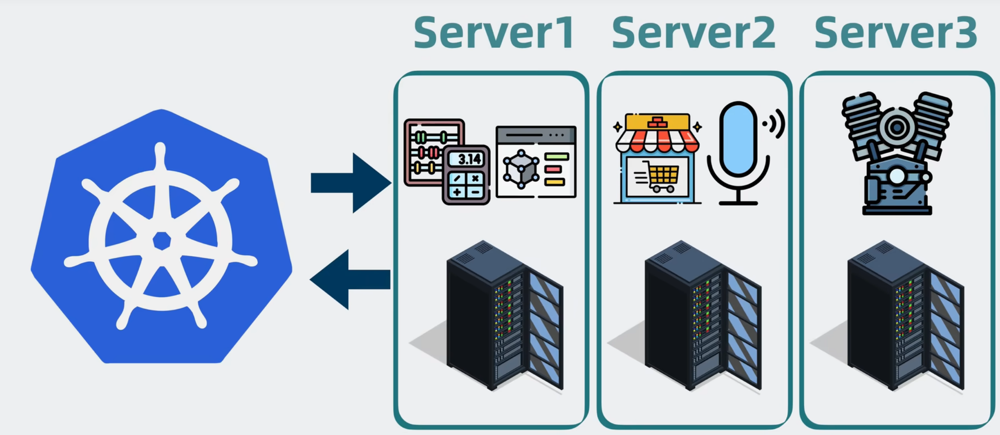
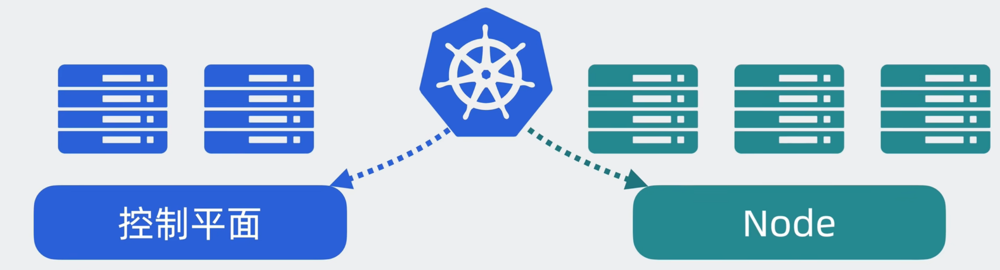
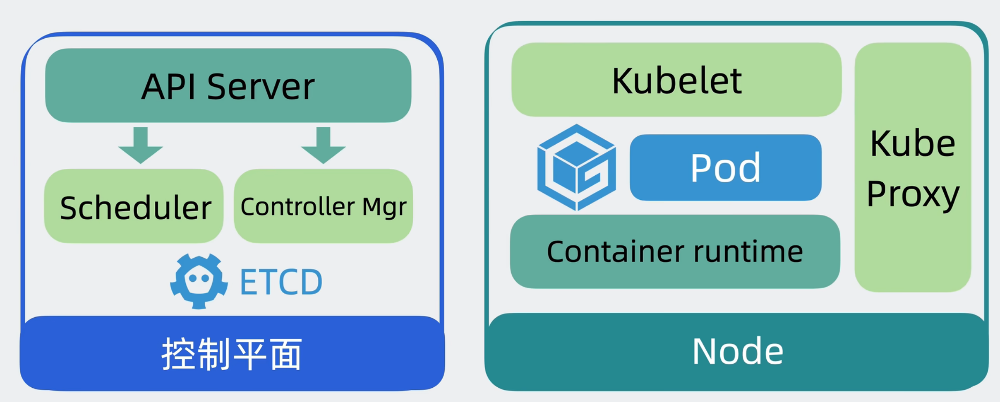
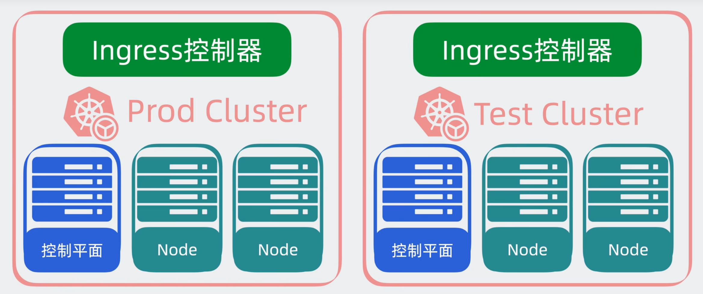
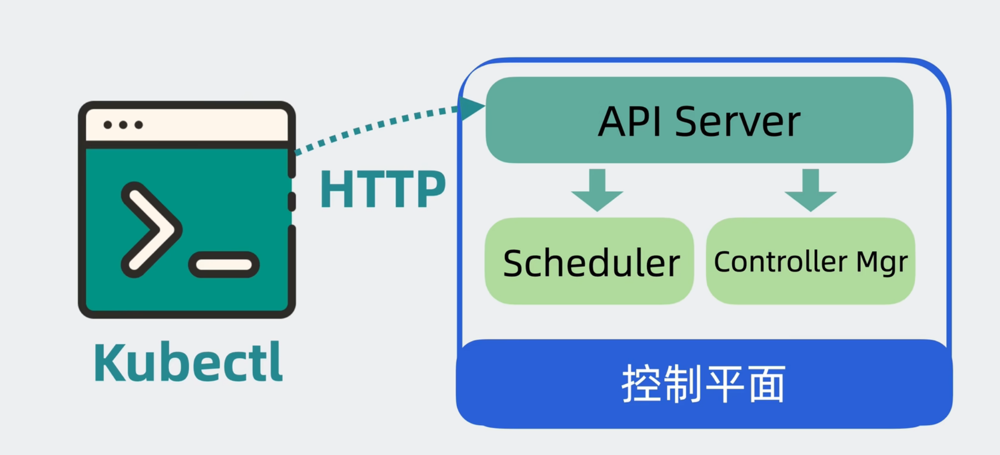
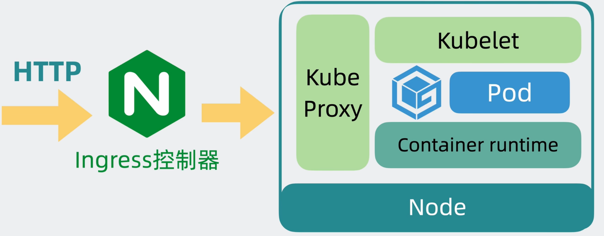
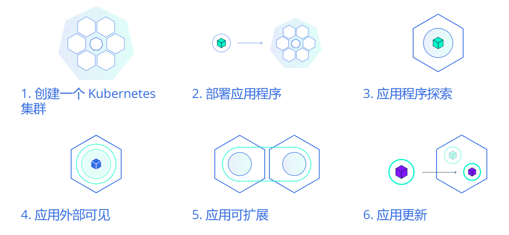

# Kubernetes

## 容器发展史

## Kubernetes

`Kubernetes` 是介于应用服务服务和服务器之间能够通过策略协调管理多个应用服务

通常只需要通过一个`yaml`文件，就能通过部署顺序将应用服务部署到各个服务器上，并且可以通过`k8s`对应用服务进行扩缩容。

## `Kubernetes`架构原理

`kubernetes` 将我们的服务器划分未两个部分一个是`控制平面(controk plane)`一个是`工作平面(node)`，简而言之就是老板和工人的关系，老板就是控制平面，`node`就是工人。

## `Kubernetes` 基础组件

## `Kubernetes` 基础模块

