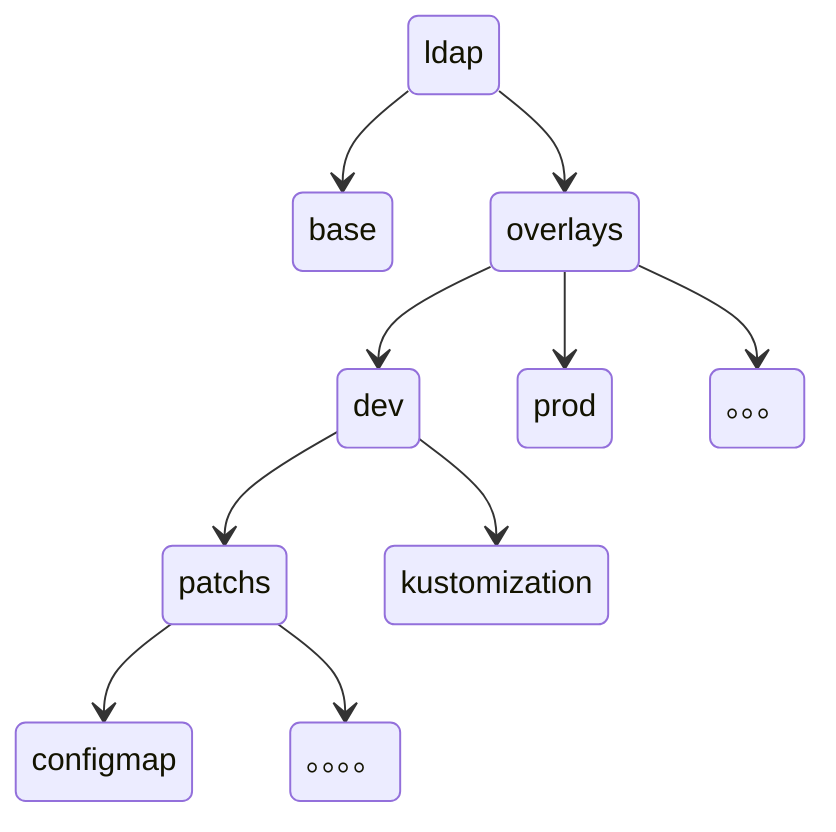

# kustomize


官网：https://kustomize.io/

## 安装

中文文档：https://kubectl.docs.kubernetes.io/zh/installation/source/

```bash
# 安装官方编译好的
# curl -s "https://raw.githubusercontent.com/kubernetes-sigs/kustomize/master/hack/install_kustomize.sh"  | bash
```


## Bespoke configuration

**配置定制**

自定义工作流，这个方式是将所以的yaml资源都为用户所有存储到用户的私有repo中，其他用户无权访问和使用。


目录结构：

一个项目，使用 `kustomize` ，假设项目名为 `ldap`用于版本控制,在项目下面创建两个层级 `base`，`overlays`

初始的`kubernetes`资源对象文件会存放在 `base` 层

`overlays` 用于存放各个资源对象的补丁,该目录下每个目录都需要包含一个`kustomize`文件以及一个或者多个`patchs`




