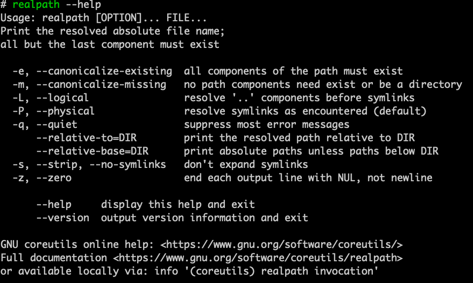
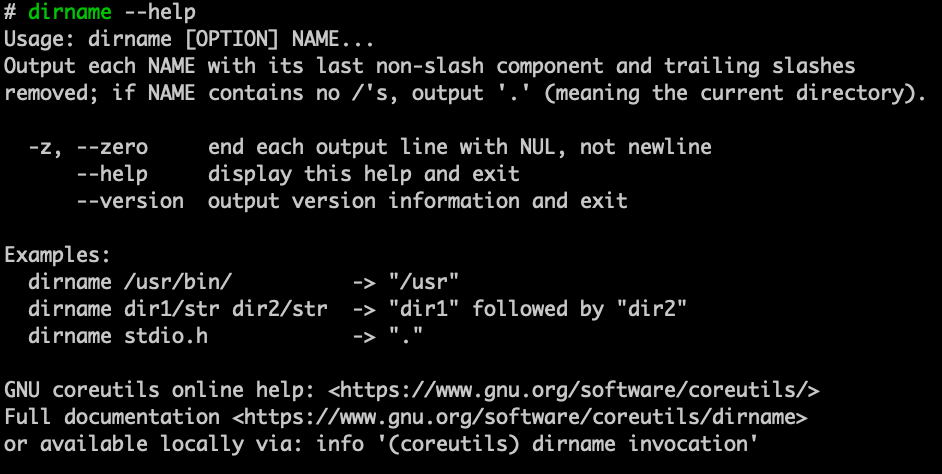
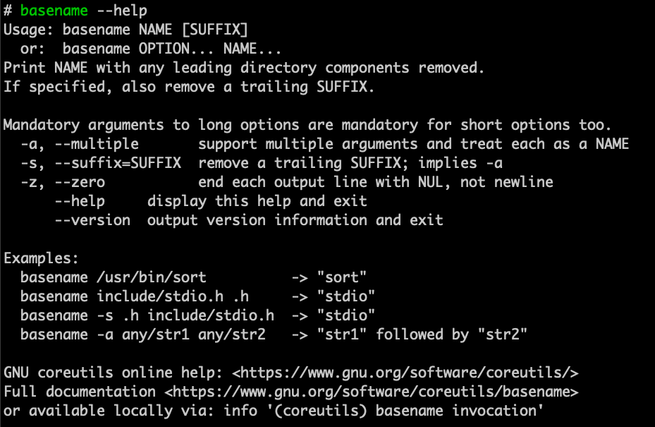

## Sell 命令补充

## 1. realpath



> realpath命令用于将每个文件名参数转换为绝对路径名

```
-e 路径的所有组成部分都必须存在(默认)
-m 路径部分不需要存在或为目录
-z 每个输出行都以 NUL 结尾，而不是换行符(默认是换行)
-L 会解析路径中的符号链接，但不继续解析符号链接所指向路径中的符号链接
-s 仅返回符号链接的原始路径，而不解析符号链接所指向的路径
```

假设目录结构：

```
/home/user/
├── file.txt
└── link -> /home/user/file.txt
```

```bash
$ realpath -L /home/user/link
/home/user/file.txt

$ realpath -s /home/user/link
/home/user/link

$ realpath -m /home/user/a.txt
/home/user/a.txt

$ realpath /home/user/a.txt
realpath: /home/user/a.txt: No such file or directory
```


## 2. dirname

> **dirname命令** 去除文件名中的非目录部分，仅显示与目录有关的内容
>
> **不对目录是否存在进行判断**



```bash
# /e/res/ 存在
$ dirname /e/res/kk.sh
/e/res

# /e/res/ 不存在
$ dirname /e/res/kk.sh
/e/res
```


```bash
# 在脚本中获取当前脚本所在目录
Path=$(cd $(dirname $0);pwd)
echo $Path
```


## 3. basename

> basename命令用于删除文件路径，只保留文件名，即返回路径中的最后一个部分
>
> **不对文件是否存在进行判断**

``` 
-a 处理多个文件名，输出多个结果
-s –suffix=SUFFIX : 仅当文件名以指定的后缀结尾时，才进行处理
-z, –zero : 文件名以NULL字符作为结尾，而不是换行符
```



```bash
$ basename /e/res/kk.sh
kk.sh

$ basename -a /e/res/kk.sh /e/aa/res.py
kk.sh
res.py
```


```bash
# 获取脚本执行的路径
BASEDIR="$( cd "$( dirname "$(realpath "$0")" )" && pwd )"
```


参考链接

- https://www.studytonight.com/linux-guide/how-to-print-the-resolved-path-realpath-command
- https://wangchujiang.com/linux-command/c/dirname.html