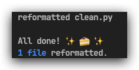
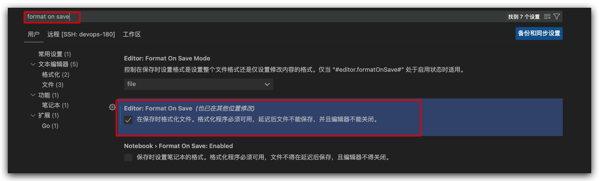
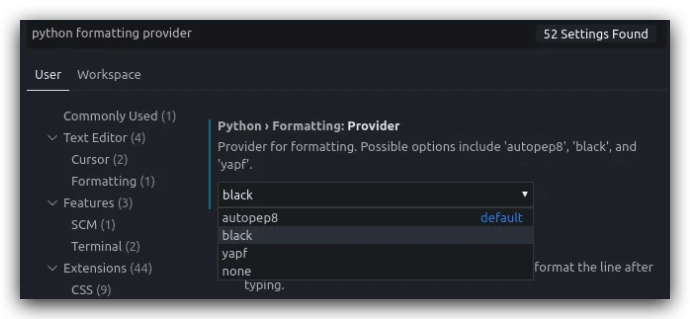
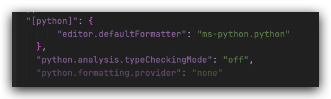

# Black Formatter On  Vscode

## 前言

使用 black 做 Python 代码风格的统一调整，使其更符合 PEP8 的 coding style。

使用 black 只会调整code 的样式，像是修飾，而不会特別修改程式上的名字或是逻辑，可以放心使用。

### 使用 black 在 terminal

**Install**

```bash
$ pip install black
```

**修饰**

```bash
# 修饰
$ black xxx.py

# 修饰项目
$ blask folde

# 修饰并打印日志
$ black -v xxx.py

-l --line-length INTEGER : 每行允許的字數（默认 88 个）
--check : 不会修改代码，只会回传修改情况。0 代表沒用修改需求，1 則代表有修改，123 則是有错误发生
```


**run**

```bash
$ black clean.py
reformatted clean.py

All done! ✨ 🍰 ✨
1 file reformatted.
```



### 使用 black 在 vscode 上

1. 安裝 python extention
2. 修改 vscode 设置
3. (optional) 调整设置


选择Python 解释器 需要安装Black Formatter


打开设置搜索`Format on save`, 开启保存自动格式化文件



搜索`Formatting Provider`, 开启当使用python 时用 < black 做 format >



如果没有找到那么可能是全局配置和用户配置打架了，用户配置覆盖了全局配置，修改`.vscode`文件夹中的`setting.json` 文件



```json
{
"[python]": {
        "editor.defaultFormatter": "ms-python.python"
    },
    "python.analysis.typeCheckingMode": "off",
    "python.formatting.provider": "none",
  	#  Extension 'Python Language Basics' cannot format <file-name>.py 如果出现此报错需要加上以下参数
  	"editor.defaultFormatter": null,
    "editor.formatOnSave": true,
    "python.formatting.provider": "black"
}
```

## 参考链接

- github 项目地址: https://github.com/psf/black#command-line-options