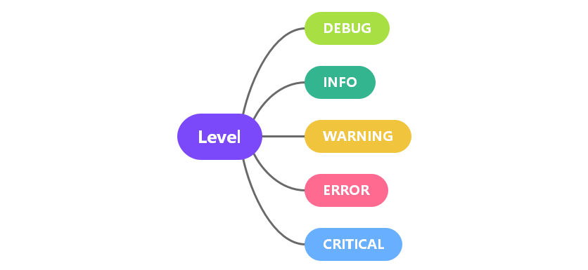
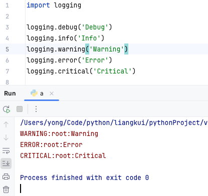
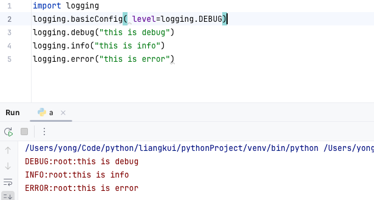
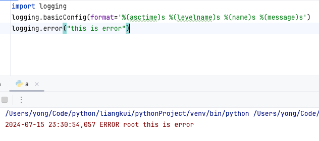

# python logging日志模块

## 日志级别

> 日志根据重要程度分为5个级别




**日志级别**	

| 日志级别 | 功能               | 描述                                                         |
| :------- | :----------------- | ------------------------------------------------------------ |
| DEBUG    | logging.debug()    | Provides detailed information that’s valuable to you as a developer. |
| INFO     | logging.info()     | Provides general information about what’s going on with your program. |
| WARNING  | Logging.warning()  | Indicates that there’s something you should look into.       |
| ERROR    | Logging.error()    | Alerts you to an unexpected problem that’s occured in your program. |
| CRITICAL | Logging.critical() | Tells you that a serious error has occurred and may have crashed your app. |


用标准库logging模块记录生成的日志,看个例子,直接导入`logging`模块，然后使用logging提供的日志消息记录方法就可以




> 从上面代码中可以看到`loging.warging`以后的日志内容都打印在标准输出流，也就是命令行窗口，但是`logging.debug`和`info`记录的日志并没有打印出来。因为默认的日志级别是 warning。

### 如何修改日志级别

如何让debug级别的信息也输出？

当然是修改默认的日志级别，在开始记录日志前可以使用`logging.basicConfig`方法来设定日志级别

```python
import logging
logging.basicConfig(level=logging.DEBUG)
logging.debug("this is debug")
logging.info("this is info")
logging.error("this is error")
```



### 如何将日志记录到文件

通过配置函数`logging.basicConfig`可以指定日志输出到什么地方, 如果每次运行前要覆盖之前的日志，则需指定 filemode='w'， 这个和 `open` 函数写数据到文件用的参数是一样的。

```python
import logging
logging.basicConfig(
  				filename="test.log", 
  				level=logging.INFO,
					encoding="utf-8",
					filemode="a",
					format="{asctime} - {levelname} - {message}",
        	style="{",
        	datefmt="%Y-%m-%d %H:%M")
logging.debug("this is debug")
logging.info("this is info")
logging.error("this is error")
```

### 格式化输出

默认输出的格式包含3部分，日志级别、日志记录器的名字、以及日志内容，中间用“:”连接。 如果我们想改变日志格式，例如想加入日期时间、显示日志器名字，我们是可以用`format`参数来设置日志的格式。

该`format`参数接受一个字符串，该字符串可以包含许多[预定义属性](https://docs.python.org/3/library/logging.html#logrecord-attributes)。

```python
import logging
logging.basicConfig(format='%(asctime)s %(levelname)s %(name)s %(message)s')
logging.error("this is error")
```




## 记录器（logger）

每一次日志记录其实都是通过一个叫做**日志记录器（Logger）**的实例对象来负责记录的，每个记录器都有一个名称，当我们直接使用`logging`来记录日志时，系统会默认创建一个名为 `root` 的记录器，这个记录器我们称为根记录器。

记录器像树结构一样支持层级，子记录器可以不单独设置日志级别以及Handler（后面会介绍），如果子记录器没有单独设置，则它的所有行为会委托给父级。


参考链接：

- https://docs.python.org/3/library/logging.html#logrecord-attributes
- https://realpython.com/python-logging/
