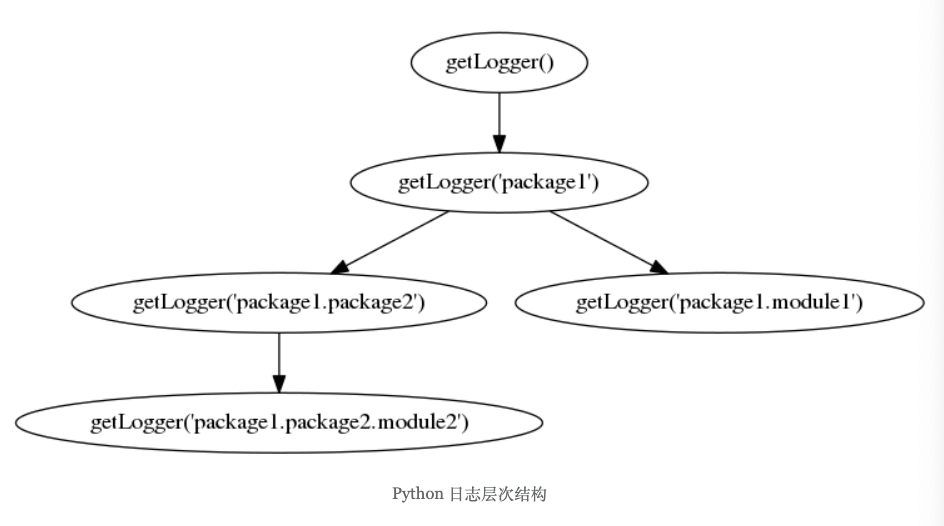
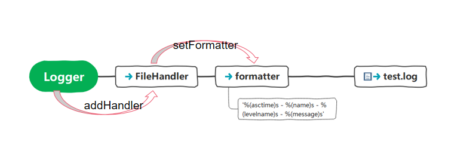

# python logging日志模块

## 日志级别

> 日志根据重要程度分为5个级别


**日志级别**	

| 日志级别 | 功能               | 描述                                                         |
| :------- | :----------------- | ------------------------------------------------------------ |
| DEBUG    | logging.debug()    | Provides detailed information that’s valuable to you as a developer. |
| INFO     | logging.info()     | Provides general information about what’s going on with your program. |
| WARNING  | Logging.warning()  | Indicates that there’s something you should look into.       |
| ERROR    | Logging.error()    | Alerts you to an unexpected problem that’s occured in your program. |
| CRITICAL | Logging.critical() | Tells you that a serious error has occurred and may have crashed your app. |

用标准库logging模块记录生成的日志,看个例子,直接导入`logging`模块，然后使用logging提供的日志消息记录方法就可以


> 从上面代码中可以看到`loging.warging`以后的日志内容都打印在标准输出流，也就是命令行窗口，但是`logging.debug`和`info`记录的日志并没有打印出来。因为默认的日志级别是 warning。

### 如何修改日志级别

如何让debug级别的信息也输出？

当然是修改默认的日志级别，在开始记录日志前可以使用`logging.basicConfig`方法来设定日志级别

```python
import logging
logging.basicConfig(level=logging.DEBUG)
logging.debug("this is debug")
logging.info("this is info")
logging.error("this is error")
```


### 如何将日志记录到文件

通过配置函数`logging.basicConfig`可以指定日志输出到什么地方, 如果每次运行前要覆盖之前的日志，则需指定 filemode='w'， 这个和 `open` 函数写数据到文件用的参数是一样的。

```python
import logging
logging.basicConfig(
  				filename="test.log", 
  				level=logging.INFO,
					encoding="utf-8",
					filemode="a",
					format="{asctime} - {levelname} - {message}",
        	style="{",
        	datefmt="%Y-%m-%d %H:%M")
logging.debug("this is debug")
logging.info("this is info")
logging.error("this is error")
```

### 格式化输出

默认输出的格式包含3部分，日志级别、日志记录器的名字、以及日志内容，中间用“:”连接。 如果我们想改变日志格式，例如想加入日期时间、显示日志器名字，我们是可以用`format`参数来设置日志的格式。

该`format`参数接受一个字符串，该字符串可以包含许多[预定义属性](https://docs.python.org/3/library/logging.html#logrecord-attributes)。

```python
import logging
logging.basicConfig(format='%(asctime)s %(levelname)s %(name)s %(message)s')
logging.error("this is error")
```


## 记录器（logger）

每一次日志记录其实都是通过一个叫做**日志记录器（Logger）**的实例对象来负责记录的，每个记录器都有一个名称，当我们直接使用`logging`来记录日志时，系统会默认创建一个名为 `root` 的记录器，这个记录器我们称为根记录器。



记录器像树结构一样支持层级，子记录器可以不单独设置日志级别以及Handler（后面会介绍），如果子记录器没有单独设置，则它的所有行为会委托给父级。

 [`basicConfig()`](https://docs.python.org/zh-cn/3/library/logging.html#logging.basicConfig) 提供了一种配置根日志记录器的快捷方式，它可以处理多种应用场景。

```python
# foo/__init__.py

import logging

logging.basicConfig()
logger = logging.getLogger(__name__)
logging.basicConfig()
logger.setLevel(logging.INFO)

logger.info("this is foo")

# > INFO:__main__:this is foo
```


```python
import logging
import sys

handler = logging.StreamHandler(stream=sys.stdout)

logger = logging.getLogger('package') # Create logger with name 'package'
logger.addHandler(handler)

child_logger = logging.getLogger('package.module')
child_logger.addHandler(handler)

child_logger.warning('This will be printed by the parent and child handlers.')

from IPython.core.display import HTML
HTML("&lt;script>Jupyter.notebook.kernel.restart()&lt;/script>")
```

```
This will be printed by the parent and child handlers.
This will be printed by the parent and child handlers.
```

可以在记录器上设置 `logger.propagate=False` 来禁用 LogRecords 到父级处理程序

```python
import logging
import sys

handler = logging.StreamHandler(stream=sys.stdout)

logger = logging.getLogger('package') # Create logger with name 'package'
logger.addHandler(handler)

child_logger = logging.getLogger('package.module')
child_logger.addHandler(handler)

child_logger.propagate = False # Prevent propagation of the LogRecord to parent handlers.

child_logger.warning('This will be only be printed by the child logger.')

from IPython.core.display import HTML
HTML("&lt;script>Jupyter.notebook.kernel.restart()&lt;/script>")


# This will be only be printed by the child logger.
```


## 处理器(Handler)

记录器专门负责日志的记录，但是日志最终记录在哪里记录器并不关心,处理器（Handler）会去处理。

```python
import logging
from logging import StreamHandler

logger = logging.getLogger(__name__)

# 标准流处理器
stream_handler = StreamHandler()
stream_handler.setLevel(logging.WARNING)

# 创建一个格式器
formatter = logging.Formatter('%(asctime)s - %(name)s - %(levelname)s - %(message)s')
# 作用在handler上
stream_handler.setFormatter(formatter)
# 添加处理器
logger.addHandler(stream_handler)

logger.info("this is info")
logger.error("this is error")
logger.warning("this is warning")
```

> ⚠️ 注: 格式器只能作用在处理器上，通过处理器的`setFromatter`方法设置格式器。注意一个 Handler 只能设置一个格式器。是一对一的关系。而 logger 与 handler 是一对多的关系，一个logger可以添加多个handler。 handler 和 logger 都可以设置日志的等级。



```python
logging.basicConfig()
logging.warning("hello")
```

两行代码等价于

```python
import sys
import logging
from logging import StreamHandler
from logging import Formatter


# Create logger with name "script file"
logger = logging.getLogger("__name__")
print(f"This logger's level is: {logger.getEffectiveLevel()}")

logger.setLevel(logging.WARNING)
handler = StreamHandler(stream=sys.stderr)
logger.addHandler(handler)
formatter = Formatter(" %(levelname)s:%(name)s:%(message)s")
handler.setFormatter(formatter)
logger.warning("hello")
```


### 日志文件配置

日志的配置除了前面介绍的将配置直接写在代码中，还可以将配置信息单独放在配置文件中，实现配置于代码分离。

日志配置文件 `logging.conf`

```logging.conf
[loggers]
keys=root

[handlers]
keys=consoleHandler

[formatters]
keys=simpleFormatter

[handler_consoleHandler]
class=StreamHandler
level=DEBUG
formatter=simpleFormatter
args=(sys.stdout,)

[formatter_simpleFormatter]
format=%(asctime)s - %(name)s - %(levelname)s - %(message)s
```

加载配置文件

```python
import logging
import logging.config

# 加载配置
logging.config.fileConfig('logging.conf')

# 创建 logger
logger = logging.getLogger()

# 应用代码
logger.debug("debug message")
logger.info("info message")
logger.warning("warning message")
logger.error("error message")
```

stdout

```
2021-12-23 00:02:07,019 - root - DEBUG - debug message
2021-12-23 00:02:07,019 - root - INFO - info message
2021-12-23 00:02:07,019 - root - WARNING - warning message
2021-12-23 00:02:07,019 - root - ERROR - error message
```


参考链接：

- https://docs.python.org/3/howto/logging.html#logging-advanced-tutorial
- https://awaywithideas.com/python-logging-a-practical-guide/
- https://docs.python.org/3/library/logging.html#logrecord-attributes
- https://docs.python.org/zh-cn/3/library/logging.html
- https://realpython.com/python-logging/
