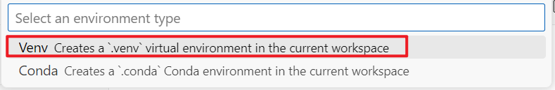
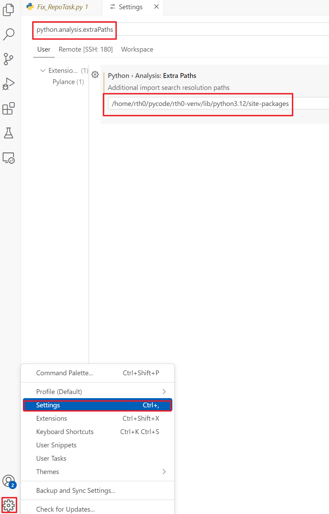

# Python 环境部署

## 1.Python 环境搭建

- 安装 `Python` 插件


- 重启以启动插件


- 创建虚拟环境

Python 开发者的最佳实践是使用特定于项目的 `virtual environment` 。一旦激活该环境，安装的任何软件包都将与其他环境（包括全局解释器环境）隔离。

可以使用 Venv 或 Conda 和 Python 在 VS Code 中创建非全局环境：创建环境。

打开**命令面板**，开始键入 **Python: Create Environment** 命令进行搜索，然后选择该命令。该命令显示环境类型列表，Venv 或 Conda。


对于显示环境类型列表, `venv` 或 `Conda`



然后会显示可用于项目的解释器列表，选择需要的解释器


选择后，将会通知创建环境的进度


**IntelliSense** 和自动补全：


## 2. Python Debug 环境

### 配置并运行调试器

把光标移动到某一行 `F9`, vscode 就会在这行设置`断点`,或者点击左键行号旁边的装订线


初始化调试器，按`F5`,第一次调试此文件，配置菜单将从命令面板打开，允许为打开的文件选择想要的调试配置类型。

选择 **Python File**，这是使用当前选择的 Python 解释器运行编辑器中显示的当前文件的配置。


通过单击编辑器上运行按钮旁边的向下箭头并在终端中选择调试 Python 文件来启动调试器


> Notes：VS Code 的所有各种配置都使用 JSON 文件，launch.json 是包含调试配置的文件的标准名称。

调试器将在文件断点的第一行停止。当前行在左边距中用黄色箭头指示。如果此时检查局部变量窗口，将看到现在已定义的 msg 变量出现在局部窗格中。


调试工具栏出现在顶部，从左到右有以下命令：继续 (`F5`)、跳过 (`F10`)、进入 (`F11`)、退出 (`⇧F11`)、重新启动 (`⇧⌘F5`) 和停止 (`⇧F5`）


还可与在调试控制台中使用变量，(在下方区域的`调试控制台`找到`DEBUG CONSOLE`),然后尝试在控制台底部的 > 提示符处输入调试代码


再次选择工具栏上的蓝色继续按钮（或按 `F5`）以运行程序直至完成。如果切换回 Python 调试控制台，一旦程序完成，VS Code 就会退出调试模式。

### Python 调试(个性化设置)

通过对调试配置文件进行修改，可以实现对调试过程中某些行为进行个性化的设置

**初始化配置**
配置文件通常会直接决定 VS Code 在调试会话期间的行为

有关调试的配置在 `launch.json` 文件中进行定义，该文件通常储存在工作区的 `.vscode `文件夹中。


要初始化调试配置，首先选择侧栏中的 “运行和调试” ,在底部左下角：


默认情况下，VS Code 仅显示 Python 扩展提供的最常见配置。可以使用列表中显示的 “Add Configuration” 命令和 launch.json 编辑器来选择要包含在 launch.json 中的其他配置。当使用该命令时，VS Code 会提示和提供所有可用配置的列表（请务必选择 Python 选项）：


选择 `Attach using Process ID`


调试期间，状态显示当前配置和当前调试解释器，选择配置会弹出列表，可以选择不同的配置：


**参数介绍**

- `name`: 提供 VS Code 下拉列表中显示的调试配置的名称

- `type`：标识要使用的调试器类型

- `request`：指定开始调试的模式

  常见的调试模式有以下两种：

  - `launch` ：在 `program` 中指定的文件上启动调试器
  - `attach` ：将调试器附加到已经运行的进程，在远程调试中会使用到

- `program`：提供 python 程序的入口模块（启动文件）的绝对路

通过指定特定的启动文件，无论打开哪些文件，始终可以确保使用相同的入口点启动程序。例如：

```
# ${file}: 编辑器中当前活动的文件
# ${workspaceFolder}: 工作空间根目录的相对路径

"program": "/data/__init__.py"
```

- `module`：提供指定要调试的模块名称的功能, 类似 `-m`

- `python`：指向用于调试的 Python 解释器的完整路径,不指定默认：工作区选择的解释器`${command:python.interpreterPath}`

- `pythonArgs`：向 Python 解释器传递参数,使用语法 `"pythonArgs": ["", "",...]` 指定要传递给 Python 解释器的参数。

- `args`：指定要传递给 Python 程序的参数, 由空格分隔的参数字符串的每个元素都应包含在引号内，例如：

  ```text
  "args": ["--quiet", "--norepeat", "--port", "1593"],
  ```

- `console`：指定在不修改 redirectOutput 的默认值的情况下如何显示程序输出
  - `internalConsole`：VS Code 调试控制台。如果 `redirectOutput` 设置为 `False`，则不显示任何输出
  - `integratedTerminal` (default) ：VS Code 集成终端。如果 `redirectOutput` 设置为 `True`，输出也会显示在调试控制台中
  - `externalTerminal`：单独的控制台窗口。如果 `redirectOutput `设置为` True`，输出也会显示在调试控制台中

- `purpose`：对 “运行” 按钮进行配置

```
将 purpose 选项设置为 debug-test ，定义在 VS Code 中调试测试时应使用该配置。
将该选项设置为 debug-in-terminal 定义了仅在访问编辑器右上角的 “运行 Python 文件” 按钮时才应使用该配置（无论该按钮提供的是 “运行 Python 文件” 还是 “调试 Python 文件” 选项）。

Notes：purpose 选项不能用于通过 F5 或 “运行 > 开始调试” 来启动调试器
```

- `autoReload`：修改后重加载

  允许在调试器执行到达断点后对代码进行更改时自动重新加载调试器。要启用此功能，请设置 `{"enable": true}`

- `cwd`：指定调试器的当前工作目录,`${workspaceFolder}` （在 VS Code 中打开的文件夹）
- `redirectOutput`：重定向输出

```
当设置为 true （internalConsole 的默认值）时，使调试器将程序的所有输出打印到 VS Code 调试输出窗口中。

如果设置为 false （integratedTerminal 和 externalTerminal 的默认值），程序输出不会显示在调试器输出窗口中。

使用 "console": "integratedTerminal" 或 "console": "externalTerminal" 时通常会禁用此选项，因为无需在调试控制台中复制输出。
```

- `justMyCode`：仅限调试用户编写的代码

- `env`：设置除系统环境变量之外的可选环境变量

```
为调试器进程设置除调试器始终继承的系统环境变量之外的可选环境变量。这些变量的值必须以字符串形式输入。
```

- `envFile`：包含环境变量定义的文件的可选路径

## 3. 经常出现蓝色黄色等波浪线**解决方式：**

- 安装 pylint


- 设置 -> `Setting` 或 `Ctrl + ,`

  

- 设置搜索 `pylint` -> `Add Item` 添加如下内容 

- ```
  "--disable=C,R,W, --enable=unreachable,duplicate-key,unnecessary-semicolon,global-variable-not-assigned,unused-variable,binary-op-exception,bad-format-string,anomalous-backslash-in-string,bad-open-mode"
  ```

- 


- 保存完成


## 4. 导入包后显示下划黄线


### **解决方式：**

- 通过 `pip show` 命令查询已经安装的包，找到包的安装路径


在设置中搜索 `python.analysis.extraPaths` 输入账号的路径即可



- 设置完成


参考链接：

- [Using Python Virtual Environment in VSCode - Tech Inscribed](https://techinscribed.com/python-virtual-environment-in-vscode/#:~:text=Open VSCode preferences (Ctrl %2B%2C) and search for,Select it%2C now the issue should be resolved.)