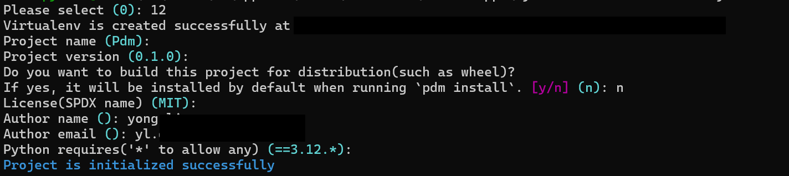

## PDM


PDM 是一个支持最新 PEP 标准的现代 Python 包和依赖项管理器。但它不仅仅是一个包管理器。它可以在各个方面提升您的开发工作流程。

```
安装程序会将 PDM 安装到用户家目录中，位置取决于系统：

$HOME/.local/bin Unix 系统
$HOME/Library/Python/<version>/bin MacOS 系统
%APPDATA%\Python\Scripts Windows 系统
```

## PDM 安装*Python*

```python
# 列出所有可用的 Python 版本
$ pdm py install -l

# 安装指定版本
$ pdm py install pypy@3.8.12
```

## PDM 切换 Python 版本

```bash
$ pdm use py38
```

## PDM 使用

### 新建项目

````bash
$ pdm init
# 最小化生成,只有 pyproject.toml
$ pdm init minimal 
选择 python 解释器
是否需要上传 PyPI
项目名称
项目版本信息
License 类型
作者信息
邮箱信息
依赖的 Python 版本
````



完成初始化之后，PDM 会将我们的选择以 toml 格式写入 *pyproject.toml* 配置文件中，并且还会生成一个 *.pdm.toml* 文件：


```toml
[project]
name = "Pdm"
version = "0.1.0"
description = "Default template for PDM package"
authors = [
    {name = "yong", email = "ylgmail.com"},
]
dependencies = []
requires-python = "==3.12.*"
readme = "README.md"
license = {text = "MIT"}


[tool.pdm]
distribution = false
```

### 查看包

```bash
# 表格形式查看
$ pdm list

# 树状图查看包
$ pdm list --graph 

# JSON 格式查看包
$ pdm list --json

# 查看某个包的具体详情
$ pdm show requests
```


### 删除包

```bash
# 删除依赖包
$ pdm remove requests
```


### 更新包

使用`pdm update`来更新全部包，或者使用`pdm update <pkg>`来更新指定包：

```bash
$ pdm update
$ pdm update requests
```

### 项目配置

终端中执行`pdm config`即可打印 PDM 配置以及项目配置，当然，我们可以不使用全局配置，可在项目下 *.pdm.toml* 文件中添加指定参数和值：


### 显示当前 *Python* 环境

```bash
$ pdm info
PDM version:
  2.18.1
Python Interpreter:
 python.exe (3.12)
Project Root:
  ./Pdm
Local Packages:
```

> 如果 **Project Packages** 是 `None`, 则启用 [virtualenv mode](https://pdm-project.org/zh-cn/latest/usage/venv/) 模式。

### 查看虚拟环境信息

```bash
$ pdm info --env
{
  "implementation_name": "cpython",
  "implementation_version": "3.12.5",
  "os_name": "nt",
  "platform_machine": "AMD64",
  "platform_release": "11",
  "platform_system": "Windows",
  "platform_version": "10.0.22631",
  "python_full_version": "3.12.5",
  "platform_python_implementation": "CPython",
  "python_version": "3.12",
  "sys_platform": "win32"
}
```

```bash
# 添加依赖
$ pdm add requests

# 添加并锁定依赖版本
$ pdm add Flask==2.0.1
$ pdm lock

# 安装依赖
$ pdm install

# 查看依赖
$ pdm list

# 创建虚拟环境, 运行代码
$ pdm run python xxx.py

# 运行 Python 解释器, 导入项目依赖
$ pdm run python -c "import pandas"
```


## 运行第一个代码

```python
import pandas as pd
print('hello')

# pdm run python hello.py
```

## PDM 脚本

### Cmd

纯文本脚本被视为普通命令，我们可以明确的指定它

```toml
[tool.pdm.scripts]
start =  {cmd = "flask run -p 3365"}
```

想要在参数之间添加注释时，它可能更方便。 要将命令指定为数组而不是字符串，请执行以下操作：

```toml
[tool.pdm.scripts]
start = {cmd = [
    "flask",
    "run",
    # 在这里添加关于始终使用端口 54321 的重要注释
    "-p", "54321"
]}
```

### Shell

Shell 脚本可用于运行更多与 Shell 相关的任务，例如管道和输出重定向。 这基本上是通过 `subprocess.Popen()` 和 `shell=True` 运行的

```toml
[tool.pdm.scripts]
filter_error = {shell = "cat error.log|grep CRITICAL > critical.log"}
```

### 脚本选项

```toml
[tool.pdm.scripts]
# 变量
# 变量 env
start.env = {FOO = "bar", FLASK_ENV = "1"}
# 变量文件 env_file
start.env_file = ".env"
# 如果希望 dotenv 文件覆盖现有的环境变量
start.env_file.override = ".env"

# 工作目录
# 为脚本设置当前目录
start.working_dir = "subdir"

# 执行前后
# 执行
pre_compress = "{{ Run BEFORE the `compress` script }}" # 在 `compress` 脚本之前运行
compress = "tar czvf compressed.tar.gz data/"
# 执行后
post_compress = "{{ Run AFTER the `compress` script }}"  # 在 `compress` 脚本之后运行
```


## 使用版本控制

**必须** 提交 `pyproject.toml` 文件。您**应该**提交 `pdm.lock` 和 `pdm.toml` 文件。**不要** commit 提交 `.pdm-python` 文件

项目元数据存储在 `pyproject.toml`。规范由 [PEP 621](https://www.python.org/dev/peps/pep-0621/)、[PEP 631](https://www.python.org/dev/peps/pep-0631/) 和 [PEP 639](https://www.python.org/dev/peps/pep-0639/) 定义。阅读 PEP 中的详细规格

## 多阶段 *Dockerfile*构建中使用PDM

```dockerfile
ARG PYTHON_BASE=3.10-slim
# 构建阶段
FROM python:$PYTHON_BASE AS builder

# 安装 PDM
RUN pip install -U pdm
# 禁用更新检查
ENV PDM_CHECK_UPDATE=false
# 复制文件
COPY pyproject.toml pdm.lock README.md /project/
COPY src/ /project/src

# 安装依赖项和项目到本地包目录
WORKDIR /project
RUN pdm install --check --prod --no-editable

# 运行阶段
FROM python:$PYTHON_BASE

# 从构建阶段获取包
COPY --from=builder /project/.venv/ /project/.venv
ENV PATH="/project/.venv/bin:$PATH"
# 设置命令/入口点，根据需要进行调整
COPY src /project/src
CMD ["python", "src/__main__.py"]
```


## 文档参考:

- [PEP 621 元数据 - PDM (pdm-project.org)](https://pdm-project.org/zh-cn/latest/reference/pep621/#__tabbed_1_2)
- [命令行参考 - PDM (pdm-project.org)](https://pdm-project.org/zh-cn/latest/reference/cli/)
- [高级用法 - PDM (pdm-project.org)](https://pdm-project.org/zh-cn/latest/usage/advanced/)
- [生命周期与钩子 - PDM (pdm-project.org)](https://pdm-project.org/zh-cn/latest/usage/hooks/)
- [编写 pyproject.toml - Python 打包用户指南](https://packaging.python.org/en/latest/guides/writing-pyproject-toml/#creating-executable-scripts)

- https://frostming.com/2022/pdm-2/
