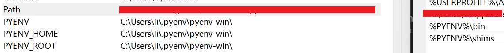
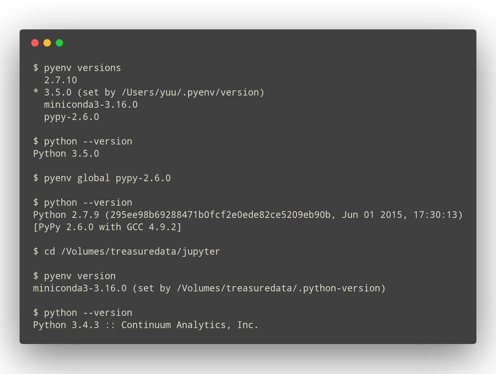
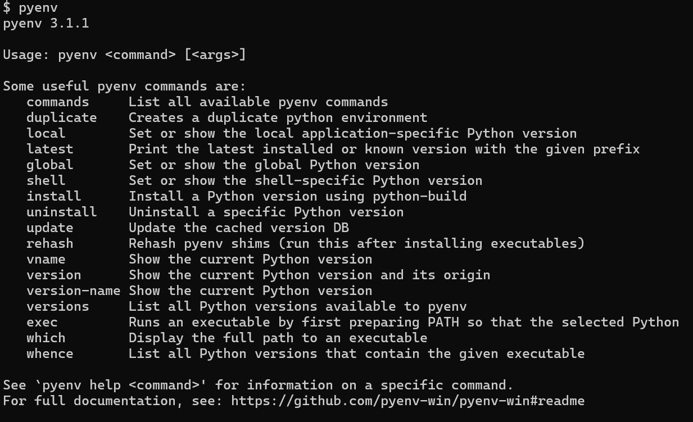
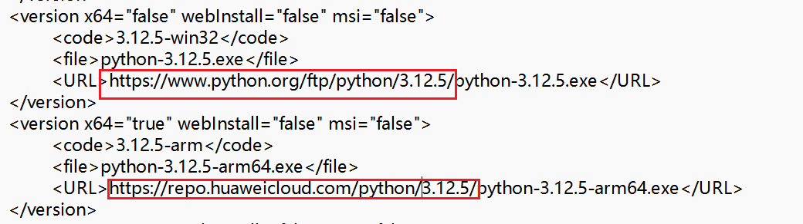
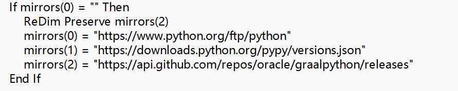

## Pyenv-win Install 


### 安装 Git Bash 

**下载项目**


``` Bash
git clone https://github.com/pyenv-win/pyenv-win.git "%USERPROFILE%\.pyenv"Bash
```


**配置环境变量**
```PowerShell
[System.Environment]::SetEnvironmentVariable('PYENV',$env:USERPROFILE + "\.pyenv\pyenv-win\","User")

[System.Environment]::SetEnvironmentVariable('PYENV_ROOT',$env:USERPROFILE + "\.pyenv\pyenv-win\","User")

[System.Environment]::SetEnvironmentVariable('PYENV_HOME',$env:USERPROFILE + "\.pyenv\pyenv-win\","User")

# 添加该命令用于使用 pyenv 命令
[System.Environment]::SetEnvironmentVariable('path', $env:USERPROFILE + "\.pyenv\pyenv-win\bin;" + $env:USERPROFILE + "\.pyenv\pyenv-win\shims;" + [System.Environment]::GetEnvironmentVariable('path', "User"),"User")
```





也可以手工添加此变量用于使用 `pyenv` 命令


```txt
%PYENV%\bin
%PYENV%\shims
```

### 校验







## 常用命令

```bash
pyenv version         # 当前系统使用的 Python 版本
pyenv versions        # 当前系统拥有的 Python 版本
pyenv install -l      # 列出所有可安装的 Python 版本
pyenv install 3.12.5          # 安装 3.12.5，可使用 -v 参数查看详细输出
pyenv uninstall 3.12.5         # 卸载 3.12.5 
pyenv local 3.12.5     # local仅对当前目录及子目录生效，告诉当前目录使用版本2.7.5，
pyenv global          # 告诉全局环境使用某个版本，为了不破坏系统环境，不建议使用global设置全局版本
pyenv rehash          # 重建环境变量，每当你增删 Python 版本或带有可执行文件的包（如 pip）以后，都应该执行一次本命令
```


## Win Pyenv 安装慢如何解决?

**解决方法**


```txt
# 修改指定版本的下载地址替换成其他国内源
# huawei: https://repo.huaweicloud.com/python
# else: https://registry.npmmirror.com/binary.html?path=python/

1. 修改文件
.pyenv\pyenv-win\.versions_cache.xml

2. 或者修改另外一个文件的配置
.pyenv\pyenv-win\libexec\libs\pyenv-install-lib.vbs


```

**.versions_cache.xml**



**pyenv-install-lib.vbs**




## 参考链接：
- Pyenv 项目地址: https://github.com/pyenv-win/pyenv-win
- Pyenv 官网: https://pyenv-win.github.io/pyenv-win/#installation
- 安装参考: https://github.com/pyenv-win/pyenv-win/blob/master/docs/installation.md#git-commands