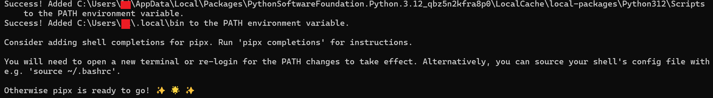

# pipx


官方：

- GitHub 仓库：https://github.com/pypa/pipx
- 文档：https://pypa.github.io/pipx/

pipx 是安装并运行 Python 终端用户应用（end-user applications）的工具,将 Python 包安全地安装在隔离环境中，同时又可以全局暴露出命令行的调用入口

这样可以避免依赖之间的冲突

pipx 依赖 pip 和 venv，Pyhton 的版本需要 **3.6+**

## 安装

Linux

```bash
# deb
$ sudo apt update
$ sudo apt install pipx

# CentOS
sudo dnf install pipx
```

推荐:

```bash
$ python3 -m pip install --user pipx

$ pip install pipx

```

> 升级： python3 -m pip install --user --upgrade pipx

## pipx 选项

pipx 安装的应用程序的默认二进制位置是`~/.local/bin`。这可以用环境变量覆盖`PIPX_BIN_DIR`。

pipx 的主要功能:

```
将 Python 包安全地安装在隔离环境中，同时又可以全局暴露出命令行的调用入口。
这样可以避免依赖之间的冲突。
列举、更新和删除使用 pipx 安装的包
在临时环境中运行某个 Python 应用的最新版
pipx 需要 Python 3.6 及以上版本，同时必须已经安装好了 pip

pipx会为安装的每一个包自动创建隔离环境，并自动设置环境变量。
安装的包能够被执行，非常使用安装那些命令行程序
```

## poetry

```Bash
# 安装pipx

pip install pipx -i -i https://pypi.tuna.tsinghua.edu.cn/simple

# pipx 需要添加环境变量才能使用，需要先找到其所在目录
C:\Users\xx\AppData\Local\Packages\xx\LocalCache\local-packages\Python312\Scripts

# 可以重复pip inxtall pipx 找到路径
pipx ensurepath
```





## 常用命令

### 安装

```bash
# 安装包
$ pipx install pandas 
```


### 升级

```Bash
# 升级指定的安装包
$ pipx upgrade pandas

# 升级所以已安装的软件包
$ pipx upgrade-all
```

### 卸载

```bash
# 卸载某个包
$ pipx uninstall pandas

# 卸载全部包
$ pipx uninstall-all

# 重装全部包
$ pipx reinstall-all
```


### 运行

在临时隔离虚拟环境中运行 Python 

此命令实际上并不安装指定程序，而是从临时虚拟环境运行它。你可以使用此命令快速测试 Python


## 参考链接

- [入门 - pipx (pypa.io)](https://pipx.pypa.io/stable/getting-started/)
- [Installation - pipx (pypa.io)](https://pipx.pypa.io/stable/installation/)
