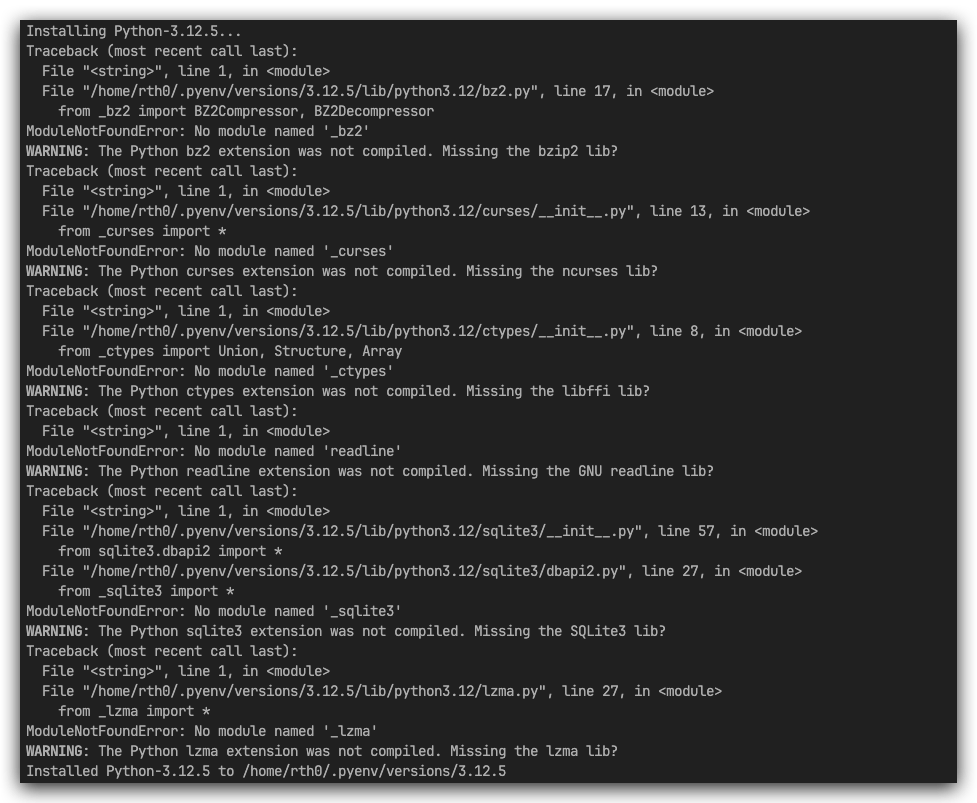

# pyenv

pyenv 是 forcked 自 Ruby 社区的简单、易用、遵循 Unix 哲学的Python 环境管理工具,它可以轻松切换全局解释器版本, 同时结合vitualenv插件可以方便的管理对应的包源


## 项目目录结构

```
python 版本: /root/.pyenv/versions/{version}
pip 安装 packages 目录：/root/.pyenv/versions/{version}/lib/python{version}site-packages
```

## 安装 pvenv

```bash
$ git clone https://github.com/pyenv/pyenv.git ~/.pyenv

# bash 执行
echo 'export PYENV_ROOT="$HOME/.pyenv"' >> ~/.bashrc
echo 'command -v pyenv >/dev/null || export PATH="$PYENV_ROOT/bin:$PATH"' >> ~/.bashrc
echo 'eval "$(pyenv init -)"' >> ~/.bashrc

# zsh 执行
echo 'export PYENV_ROOT="$HOME/.pyenv"' >> ~/.zshrc
echo '[[ -d $PYENV_ROOT/bin ]] && export PATH="$PYENV_ROOT/bin:$PATH"' >> ~/.zshrc
echo 'eval "$(pyenv init -)"' >> ~/.zshrc
```

安装建议参考`Dockerfile`

> https://github.com/pyenv/pyenv/blob/master/Dockerfile

```bash
$ apt-get update -y
$ apt-get install -y make build-essential  libssl-dev zlib1g-dev libbz2-dev \
	  libreadline-dev libsqlite3-dev  wget  curl  llvm  libncurses5-dev libncursesw5-dev \
  	xz-utils tk-dev libffi-dev liblzma-dev python-openssl git 
```


## 常用命令参考

```bash
$ pyenv commands		# 列出所有的 pyenv 命令
$ pyenv local unset | <-version -> 	# 取消设置版本/ 设置 python 的本地版本, 可以设置多个版本
$ pyenv global  | <- version ->	# system 告诉 pyenv 使用系统的 Python 指定多个版本作为全局的 Python
$ pyenv shell	pypy-2.2.1 | --unset | <- version ->	# 设定 特定 shell 的 Python 版本 | 取消设置 shell 版本 | 设定多版本的 Python
$ pyenv install --list | <- vsersion -> |	--help # 列出要安装的 Python 的所有版本 | 安装指定版本:latest -->pyenv install 3:latest 
$ pyenv uninstall 	# 卸载 Python 版本
$ pyenv rehash	# 安装 pyenv 已知的所有 Python 二进制文件，即 (~/.pyenv/versions/*/bin/*)
$ pyenv version	# 显示当前活动的 Python 版本及其设置方式的信息。
$ pyenv versions	# 显示 已经安装的 Python 版本列表
$ pynv which <- python version-> 	# 显示运行给定命令时 pyenv 将调用的可执行文件的完整路径
$ pyenv whence 2to3 	# 列出安装了给定命令的所有 Python 版本
$ pyenv root	 # 列出 pyenv 的安装路径
$ pyenv exec	# 指定 Path 执行，pyenv exec pip install -r requirements.txt --> PATH="$PYENV_ROOT/versions/3.9.7/bin:$PATH" pip install -r requirements.txt
$ pythenv prefix  <- version -># 显示安装指定版本的目录

$ pyenv shim 	# 列出现有的 pyenv shims
$ pyenv init 	  #  为 pyenv 配置 shell 环境
$ pyenv completions    # 列出给定 pyenv 命令的可用补全
```


## Pyenv 插件 pyenv-virtunalenv

插件安装位置: `$(pyenv root)/plugins/pyenv-virtualenv`

```bash
$ git clone https://github.com/pyenv/pyenv-virtualenv.git $(pyenv root)/plugins/pyenv-virtualenv

# 激活插件(循环环境)
# bash
$ echo 'eval "$(pyenv virtualenv-init -)"' >> ~/.bashrc

# zsh
$ echo 'eval "$(pyenv virtualenv-init -)"' >> ~/.zshrc

# 激活环境
$ exec "$SHELL"


- /root/.pyenv/versions/<- 虚拟环境名 ->
/root/.pyenv/versions/{Python Version}/envs/<- 虚拟环境名 ->
```

## 命令: env

```bash
$ pyenv virtualenv <-Python version-> <- 虚拟环境名 -> 	# 创建指的 python 环境的虚拟环境 --->pyenv virtualenv 3.12.0 envs33
$ pyenv virtualenv <-虚拟环境名->	# 从当前版本创建虚拟环境
$ pyenv virtualenvs 	# 列出现有虚拟环境
$ pyenv shell <- 虚拟环境名 -> 	# 使用虚拟环境
$ pyenv activate <- 虚拟环境名 ->  # 使用虚拟环境
$ pyenv deactivate  	# 退出虚拟环境
$ pyenv (uninstall  | virtualenv-delete) <- 虚拟环境名 ->  # 删除现有的虚拟环境
```


## Install Question

### Pyenv install 下载慢(失败)

打开[Python 官网](https://link.juejin.cn/?target=https%3A%2F%2Fwww.python.org%2F) 或者[python ftp](https://www.python.org/ftp/python/)然后下载指定的版本包,放置到指定路径下，执行`pyenv install 3.12.0` 安装即可

路径：

- linux： `/root/.pyenv/cache`
- windows: `D:\pyenv-win\pyenv-win\install_cache`


### Pyenv 安装 3.12.5 依赖问题




解决方式：

```bash
# Ubuntu:
$ sudo apt-get update
$ sudo apt install libssl-dev # ssl err
$ sudo apt install libbz2-dev libncurses5-dev libncursesw5-dev libffi-dev libreadline-dev libsqlite3-dev liblzma-dev

$  pyenv install 3.12.5                                                                            [14:23:18]
pyenv: /home/rth0/.pyenv/versions/3.12.5 already exists
continue with installation? (y/N) y
Installing Python-3.12.5...
Installed Python-3.12.5 to /home/rth0/.pyenv/versions/3.12.5
```


- [pyenv](https://github.com/pyenv/pyenv)

- [pyenv install ](https://github.com/pyenv/pyenv-installer) 

- 命令参考： https://github.com/pyenv/pyenv/blob/master/COMMANDS.md#pyenv-latest
- 插件地址： https://github.com/pyenv/pyenv-virtualenv
