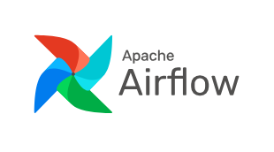
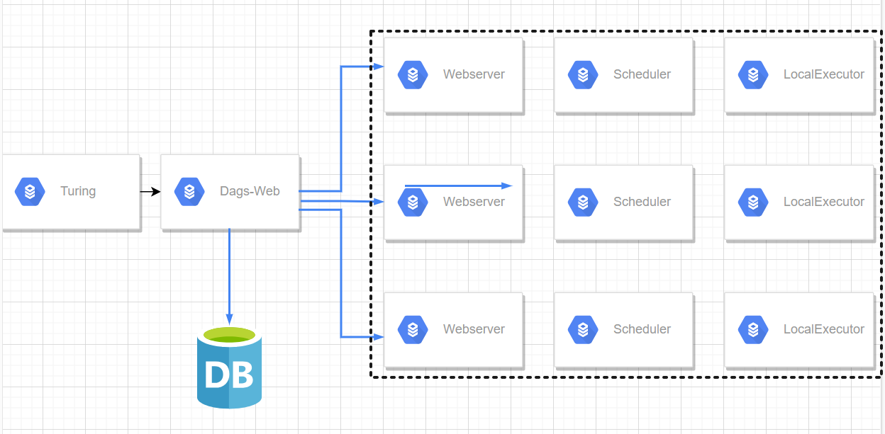

# Airflow

## Airflow介绍

### 1. 基本概念

Airflow是一个以编程方式创作，可进行调度和监控工作流程的开源平台。**基于有向无环图(DAG)**，airflow可以定义一组有依赖的任务，按照依赖依次执行。airflow提供了丰富的命令行工具用于系统管控，而其web管理界面同样也可以方便的管控调度任务，并且对任务运行状态进行实时监控，方便了系统的运维和管理。

**工作流即代码( Workflows as code )**

### 2. Airflow用途和优势

#### 2.1. 用途

Airflow的用途非常广阔，包括以下几种

- 监控自动化工作的情况（通过web UI和各个worker上记录的执行历史）
- 自动处理并传输数据
- 为机器学习或推荐系统提供一个数据管道和使用框架

#### 2.2.优势

- **便于管理：**可系统配置、作业管理、运行监控、报警、日志查
- **内嵌感应器：**假如你的工作流并不依赖于定时执行，而是依赖于例如某个文件的大小超过1GB，内嵌感应器就会派上用场
- **内嵌重试机制**：如果工作流中任意一个环节出现了问题，都可以通过内嵌的重试机制，要求它重新执行
- **可追溯性强**：大到整个工作流的数据流动，小到每个worker的执行历史，Airflow都会为提供来龙去脉，便于在出现问题的时候定位复现
- **自主定制性强**：支持各种 connnections 的 hook

#### 2.3.缺点

- airflow 页面不支持中文，所有选项填入中文都会报错: 
  - General Error <class ‘UnicodeEncodeError’>

- airflow的 dag 文件中不支持中文，会报错：
  - UnicodeEncodeError: ‘charmap’ codec can’t encode characters in position 143-148: character maps to

- 学习成本较大，不是开箱即用，用着也那么不简单

### 3. Airflow基本结构

#### 3.1. Airflow组件及架构

在一个可扩展的生产环境中，Airflow通常含有以下组件：

MetaStore：

 用于保存Airflow的元数据，需要MySQL5.7+ 或 Postgresql9.6+作为元数据库的支持

Executor：

 执行器，DAG任务的执行者，当worker的执行器为celeryExecutor时，可分布式去执行任务，这需要有对应的消息队列

Scheduler：

 任务调度器，其将会不停轮询编译dag文件，【发送可执行的任务到消息队列中，】将dag信息和调度信息写入元数据库中，不停更新dag状态

Webserver：

 提供web ui界面的dag操作，dag任务的启停，task的运行管理等，查看task的运行情况

##### 组件架构关系图

- 一个DAG就是一个工作流，里面包含了许多个task，这些DAG通过Scheduler来进行调度，然后通过Executor进行执行。

- Executor包括SequentialExecutor、LocalExecutor以及CeleryExecutor，用的较多的是LocalExecutor和CeleryExecutor。

- 元数据库存放了DAG和DAG执行相关信息，通过Webserver的UI界面可以查看这些信息。

- LDAP是轻量目录访问协议，英文全称是Lightweight Directory Access Protocol，一般都简称为LDAP

- 若airflow为分布式的时候就需要消息队列进行订阅发布多通道模式，消息队列可以是Redis或RabbitMQ，接收从scheduler端发送过来的task执行命令，等待worker端的celery去消费task

  

#### 3.2. 不同Executor的架构

##### 3.2.1.基于SequentialExecutor架构原理图

**SequentialExecutor**表示单进程顺序执行，通常只用于测试。

##### 3.2.2.基于LocalExecutor架构原理图

一个dag分配到1台机器上执行。如果task不复杂同时task环境相同，可以采用这种方式，方便扩容、管理，同时没有master单点问题。

##### 3.2.3.基于celeryExecotor的分布式架构图

- master节点webui管理dags、日志等信息
- scheduler负责调度，只支持单节点，多节点启动scheduler可能会挂掉
- worker负责执行具体dag中的task。这样不同的task可以在不同的环境中执行
- turing为外部系统

调度过程

Scheduler读取DAG配置文件，将需要执行的Job信息发给MQ，并且在MetaStore里面注册Job信息和存储DAG文件相关信息。
MQ里面按照环境有很多channel，Scheduler的Job会根据需要执行的环境发到相应的channel里面。
Executor消费MQ相应的channel，进行执行，执行结果更新到metastore中，并将log暴露到Executor的某个http端口上调用，并存入数据库中。
Web读取数据库里面的Job信息，展示Job的执行结果，并从数据库中获取log的url，展示log。
Web上发现执行错误的Job可以点击重试，直接发送Job给MQ里，并改变数据库里面Job的状态。

#### 3.3.Worker和celery

celery是一个分布式调度框架，其本身无队列功能，需要使用第三方组件，比如redis或者rabbitmq，支持异步定时调用。

- **worker**：独立的进程，任务执行单元，持续监控队列中是否有需要处理的任务
- **broker**：消息传输中间件，任务调度队列，接受生产者发送的消息，将任务存入队列
- **任务模块**：包含异步任务和定时任务，异步任务通常在业务逻辑中被触发发往任务队列，定时任务由beat进程周期性发送
- **result_backend**：存储任务执行结果, 例如mysql或pg

#### 3.4.Airflow依赖处理

> Airflow的核心概念，是DAG(有向无环图)

DAG由一个或多个TASK组成，而这个DAG正是解决了任务间的依赖问题。Task A 执行完成后才能执行 Task B，多个Task之间的依赖关系可以很好的用DAG表示完善。

示例：

只有当`print_data` 执行后才会执行`sleep`和`templated`。

