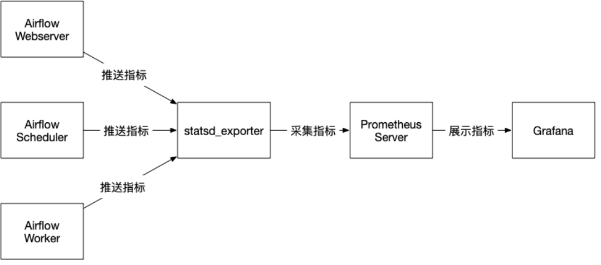

# Airflow Dags 监控

## airflow metrics 监控流程



### 环境准备

- airflow 
  - ```bash
    StatsD:  
    $ pip install 'apache-airflow[statsd]'
    ```
  
  - ````bash
    OpenTelemetry: 
    $ pip install 'apache-airflow[otel]'
    ````
  
- prometheus + grafana

Airflow 设置将指标发送到`StatsD` 或者 `OpenTelemetry`

更新 _Airflow configuration file:_ `airflow.cfg` 


## 参考链接

- [Configuration Reference ](https://airflow.apache.org/docs/apache-airflow/stable/configurations-ref.html#config-metrics)

- [Metrics Configuration](https://airflow.apache.org/docs/apache-airflow/stable/administration-and-deployment/logging-monitoring/metrics.html)