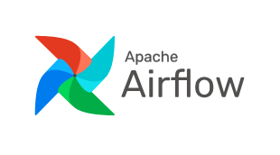
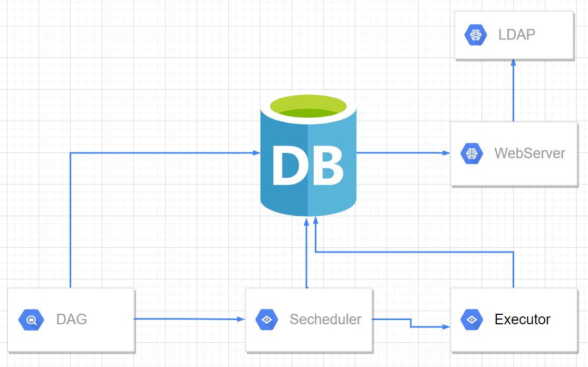
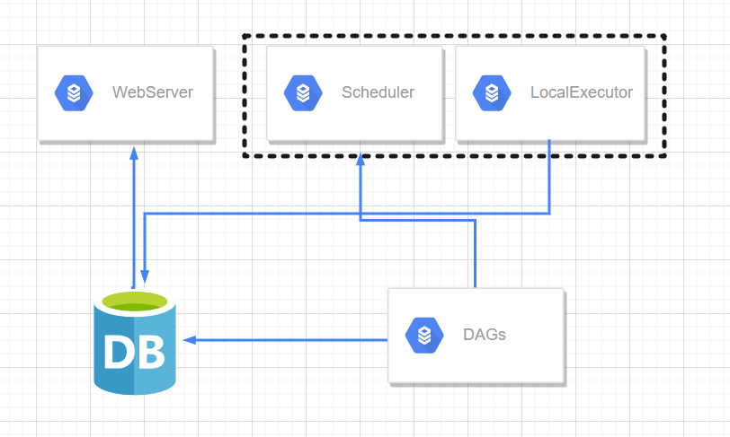
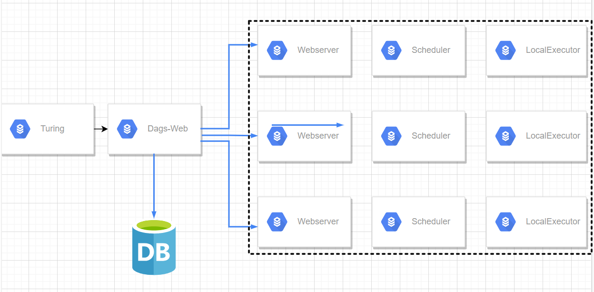
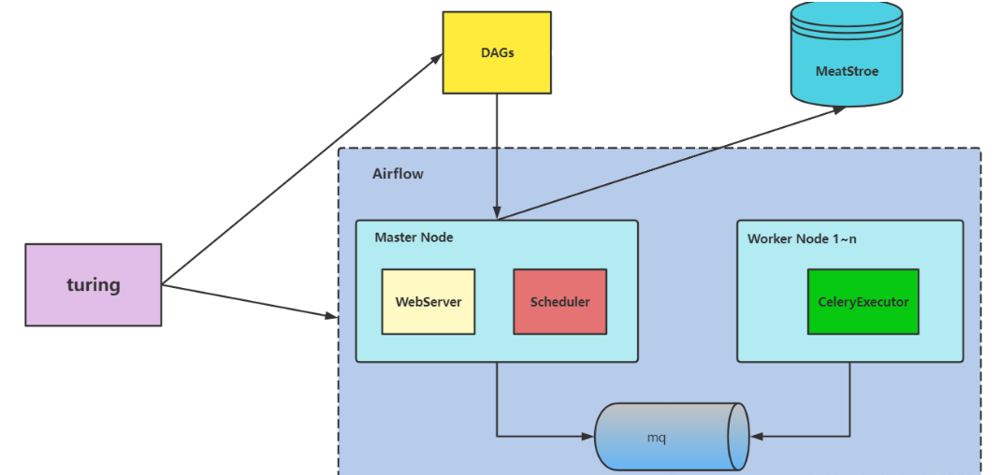
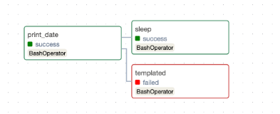

# Airflow



## Airflow介绍

### 1. 基本概念

Airflow是一个以编程方式创作，可进行调度和监控工作流程的开源平台。**基于有向无环图(DAG)**，airflow可以定义一组有依赖的任务，按照依赖依次执行。airflow提供了丰富的命令行工具用于系统管控，而其web管理界面同样也可以方便的管控调度任务，并且对任务运行状态进行实时监控，方便了系统的运维和管理。

**工作流即代码( Workflows as code )**

### 2. Airflow用途和优势

#### 2.1. 用途

Airflow的用途非常广阔，包括以下几种

- 监控自动化工作的情况（通过web UI和各个worker上记录的执行历史）
- 自动处理并传输数据
- 为机器学习或推荐系统提供一个数据管道和使用框架

#### 2.2.优势

- **便于管理：**可系统配置、作业管理、运行监控、报警、日志查
- **内嵌感应器：**假如你的工作流并不依赖于定时执行，而是依赖于例如某个文件的大小超过1GB，内嵌感应器就会派上用场
- **内嵌重试机制**：如果工作流中任意一个环节出现了问题，都可以通过内嵌的重试机制，要求它重新执行
- **可追溯性强**：大到整个工作流的数据流动，小到每个worker的执行历史，Airflow都会为提供来龙去脉，便于在出现问题的时候定位复现
- **自主定制性强**：支持各种 connnections 的 hook

#### 2.3.缺点

- airflow 页面不支持中文，所有选项填入中文都会报错: 
  - General Error <class ‘UnicodeEncodeError’>

- airflow的 dag 文件中不支持中文，会报错：
  - UnicodeEncodeError: ‘charmap’ codec can’t encode characters in position 143-148: character maps to

- 学习成本较大，不是开箱即用，用着也那么不简单

### 3. Airflow基本结构

#### 3.1. Airflow组件及架构

在一个可扩展的生产环境中，Airflow通常含有以下组件：

MetaStore：

 用于保存Airflow的元数据，需要MySQL5.7+ 或 Postgresql9.6+作为元数据库的支持

Executor：

 执行器，DAG任务的执行者，当worker的执行器为celeryExecutor时，可分布式去执行任务，这需要有对应的消息队列

Scheduler：

 任务调度器，其将会不停轮询编译dag文件，【发送可执行的任务到消息队列中，】将dag信息和调度信息写入元数据库中，不停更新dag状态

Webserver：

 提供web ui界面的dag操作，dag任务的启停，task的运行管理等，查看task的运行情况

##### 组件架构关系图



- 一个DAG就是一个工作流，里面包含了许多个task，这些DAG通过Scheduler来进行调度，然后通过Executor进行执行。

- Executor包括SequentialExecutor、LocalExecutor以及CeleryExecutor，用的较多的是LocalExecutor和CeleryExecutor。

- 元数据库存放了DAG和DAG执行相关信息，通过Webserver的UI界面可以查看这些信息。

- LDAP是轻量目录访问协议，英文全称是Lightweight Directory Access Protocol，一般都简称为LDAP

- 若airflow为分布式的时候就需要消息队列进行订阅发布多通道模式，消息队列可以是Redis或RabbitMQ，接收从scheduler端发送过来的task执行命令，等待worker端的celery去消费task

  

#### 3.2. 不同Executor的架构

| 执行器类型         | 解释                                                         |
| ------------------ | ------------------------------------------------------------ |
| SequentialExecutor | (默认: 顺序执行)，一次只执行一次任务, 只用于测试             |
| LocalExecutor      | 多进程本地执行, 用python 的多进程库达到多任务并发执行        |
| CeleryExecutor     | 远程分布式执行，使用celery 作为执行器，可以多服务器跑，分布式可扩展 |
| DaskExecutor       | 用于动态任务调度, 常用与数据分析                             |
| KubernetesExector  | Kubernetes 执行                                              |


##### 3.2.1.基于SequentialExecutor架构原理图

**SequentialExecutor**表示单进程顺序执行，通常只用于测试。



##### 3.2.2.基于LocalExecutor架构原理图

一个dag分配到1台机器上执行。如果task不复杂同时task环境相同，可以采用这种方式，方便扩容、管理，同时没有master单点问题。



##### 3.2.3.基于celeryExecotor的分布式架构图

- master节点webui管理dags、日志等信息
- scheduler负责调度，只支持单节点，多节点启动scheduler可能会挂掉
- worker负责执行具体dag中的task。这样不同的task可以在不同的环境中执行
- turing为外部系统



调度过程

Scheduler读取DAG配置文件，将需要执行的Job信息发给MQ，并且在MetaStore里面注册Job信息和存储DAG文件相关信息。
MQ里面按照环境有很多channel，Scheduler的Job会根据需要执行的环境发到相应的channel里面。
Executor消费MQ相应的channel，进行执行，执行结果更新到metastore中，并将log暴露到Executor的某个http端口上调用，并存入数据库中。
Web读取数据库里面的Job信息，展示Job的执行结果，并从数据库中获取log的url，展示log。
Web上发现执行错误的Job可以点击重试，直接发送Job给MQ里，并改变数据库里面Job的状态。

#### 3.3.Worker和celery

celery是一个分布式调度框架，其本身无队列功能，需要使用第三方组件，比如redis或者rabbitmq，支持异步定时调用。

- **worker**：独立的进程，任务执行单元，持续监控队列中是否有需要处理的任务
- **broker**：消息传输中间件，任务调度队列，接受生产者发送的消息，将任务存入队列
- **任务模块**：包含异步任务和定时任务，异步任务通常在业务逻辑中被触发发往任务队列，定时任务由beat进程周期性发送
- **result_backend**：存储任务执行结果, 例如mysql或pg

#### 3.4.Airflow依赖处理

> Airflow的核心概念，是DAG(有向无环图)

DAG由一个或多个TASK组成，而这个DAG正是解决了任务间的依赖问题。Task A 执行完成后才能执行 Task B，多个Task之间的依赖关系可以很好的用DAG表示完善。

示例：

只有当`print_data` 执行后才会执行`sleep`和`templated`。




#### 3.5 Dag 生命周期

`airflow` 以 `dag` 为调度单位，一个`dag`包含一个或多个`task`

| dag     | task      | Err_task     |
| ------- | --------- | ------------ |
| None    | None      | Up_for_retry |
| Running | scheduled | Filed        |
| Success | Queued    | ShutDown     |
| Filed   | Running   |              |
|         | Success   |              |


#### 3.6 airflow 依赖包

| 包名              | 安装命令                                        | 说明                                                         |
| ----------------- | ----------------------------------------------- | ------------------------------------------------------------ |
| all               | `pip install apache-airflow[all]`               | 所有 Airflow 功能，全家桶                                    |
| all_dbs           | `pip install apache-airflow[all_dbs]`           | 所有集成的数据库                                             |
| async             | `pip install apache-airflow[async]`             | Gunicorn 的异步 worker classes                               |
| celery            | `pip install apache-airflow[celery]`            | CeleryExecutor                                               |
| cloudant          | `pip install apache-airflow[cloudant]`          | Cloudant hook                                                |
| crypto            | `pip install apache-airflow[crypto]`            | 加密元数据 db 中的连接密码                                   |
| devel             | `pip install apache-airflow[devel]`             | 最小开发工具要求                                             |
| devel_hadoop      | `pip install apache-airflow[devel_hadoop]`      | Airflow + Hadoop stack 的依赖                                |
| druid             | `pip install apache-airflow[druid]`             | Druid.io 相关的 operators 和 hooks                           |
| gcp_api           | `pip install apache-airflow[gcp_api]`           | Google 云平台 hooks 和 operators（使用`google-api-python-client` ） |
| github_enterprise | `pip install apache-airflow[github_enterprise]` | Github 企业版身份认证                                        |
| google_auth       | `pip install apache-airflow[google_auth]`       | Google 身份认证                                              |
| hdfs              | `pip install apache-airflow[hdfs]`              | HDFS hooks 和 operators                                      |
| hive              | `pip install apache-airflow[hive]`              | 所有 Hive 相关的 operators                                   |
| jdbc              | `pip install apache-airflow[jdbc]`              | JDBC hooks 和 operators                                      |
| kerberos          | `pip install apache-airflow[kerberos]`          | Kerberos 集成 Kerberized Hadoop                              |
| kubernetes        | `pip install apache-airflow[kubernetes]`        | Kubernetes Executor 以及 operator                            |
| ldap              | `pip install apache-airflow[ldap]`              | 用户的 LDAP 身份验证                                         |
| mssql             | `pip install apache-airflow[mssql]`             | Microsoft SQL Server operators 和 hook，作为 Airflow 后端支持 |
| mysql             | `pip install apache-airflow[mysql]`             | MySQL operators 和 hook，支持作为 Airflow 后端。 MySQL 服务器的版本必须是 5.6.4+。 确切的版本上限取决于`mysqlclient`包的版本。 例如， `mysqlclient` 1.3.12 只能与 MySQL 服务器 5.6.4 到 5.7 一起使用。 |
| password          | `pip install apache-airflow[password]`          | 用户密码验证                                                 |
| postgres          | `pip install apache-airflow[postgres]`          | Postgres operators 和 hook，作为 Airflow 后端支持            |
| qds               | `pip install apache-airflow[qds]`               | 启用 QDS（Qubole 数据服务）支持                              |
| rabbitmq          | `pip install apache-airflow[rabbitmq]`          | rabbitmq 作为 Celery 后端支持                                |
| redis             | `pip install apache-airflow[redis]`             | Redis hooks 和 sensors                                       |
| s3                | `pip install apache-airflow[s3]`                | `S3KeySensor`，`S3PrefixSensor`                              |
| samba             | `pip install apache-airflow[samba]`             | `Hive2SambaOperator`                                         |
| slack             | `pip install apache-airflow[slack]`             | `SlackAPIPostOperator`                                       |
| ssh               | `pip install apache-airflow[ssh]`               | SSH hooks 及 Operator                                        |
| vertica           | `pip install apache-airflow[vertica]`           | 做为 Airflow 后端的 Vertica hook 支持                        |


### 4. 配置airflow

`airflow.cfg`

```
[core]
dags_folds = /app/dags # 需要使用绝对路径
default_timezone = Asia/Shanghai # 设置时区
executor = LocalExector # 执行器
sql_alchemy_conn = # 数据库连接
sql_engine_encoding = 'utf-8' # 数据库编码
sql_alchemy_pool_enabled = True # 是否与 SqlAlchemy 库进行数据交互
sql_alchemy_pool_size = 5 # 最大连接池初始化连接数
parallelism = 32 # 控制每个 Airflow worker 可以一次同时运行task的数量，默认: 32
dag_concurrency = 16 # 控制每个dag运行过程中最大可同时运行的task实例数
dags_are_paused_at_creation = True # 创建新的DAG时，是否暂停
max_active_runs_per_dag = 16 # 同一时间最大运行dag的数量，默认为16
max_db_retries = 3 # 任务失败重试次数
load_examples = False # 是否加载示例 dags，默认为True
plugins_folder = /app/plugins # airflow 插件存放位置
killed_task_cleanup_time = 120 # 任务强行呗杀掉后，清理时间 默认60s
default_pool_task_slot_count = 128 # 默认pool任务插槽数量为128个


[logging]
base_log_folder = /app/logs # airflowbu本地日志存储目录
remote_logging = False # 若想设置远程陌路存储，需要设置为True

# 日志级别
logging_level = INFO
fab_logging_level = WARNING


[api]
# 默认是deny_all（拒绝所有请求）
# auth_backend = airflow.api.auth.backend.deny_all
auth_backend = airflow.api.auth.backend.basic_auth


[webserver]
base_url = http://0.0.0.0:80
default_ui_timezone = Asia/Shanghai # web ui页面使用的时区
web_server_host = 0.0.0.0 # # web的IP地址
web_server_port = 80 # 运行web服务端口号

# 超时时间，默认120S
web_server_master_timeout = 300
web_server_worker_timeout = 300
workers = 4 # 表示开启4个gunicorn worker(进程)处理web请求，默认4
worker_refresh_interval = 30 # 刷新时间,默认6000s
expose_config = False # 设置web端Configuration不显示配置信息
default_dag_run_display_number = 15 # 加载Airflow UI界面的时间


[email]
default_email_on_retry = False # 任务重试时是否发送邮件提醒 
default_email_on_failure = True # 任务失败时是否发送邮件提醒


[smtp]

smtp_host = smtp.163.com # 邮箱smtp的host， 默认localhost

smtp_starttls = True # 加密通讯。默认true
smtp_ssl = False
# Example: smtp_user = airflow
smtp_user = # 邮箱
# Example: smtp_password = airflow
smtp_password = 邮箱设置里smtp密码
# smtp端口，默认25,若smtp_ssl=true,则为465
smtp_port = 25
smtp_mail_from = 邮箱
smtp_timeout = 30
smtp_retry_limit = 5


[scheduler]
scheduler_heartbeat_sec = 60  调度程序尝试触发新任务的时间（秒）
min_file_process_interval = 10 # 检测新dag的时间（秒），默认30s
# 是否使用catchup功能, 即是否执行自上次execute_date以来所有未执行的DAG Run, 另外定义每个DAG对象可传递catchup参数进行覆盖
catchup_by_default = True
orphaned_tasks_check_interval = 300.0 # 调度程序应多久（以秒为单位）检查一次孤立的任务和调度对象
child_process_log_directory = /appcom/modules/airflow/logs/scheduler
```


### 5. airflow 基本命令

```bash
# 初始化数据库
$ airflow db init  

# 创建 airflow 账户
$ airflow users create --username username --firstname firstname --lastname lastname --role Admin,viewer,Public --email xxxxx@xxx.com	--password password
```


- [sql_alchemny_conn](https://airflow.apache.org/docs/apache-airflow/stable/howto/set-up-database.html)
- 
