# iSCSI

## 1、存储技术简介

### 存储技术分类

- DAS（直连式存储）：DAS 将存储设备通过 SCSI 接口或者光纤通道直接连接到一台服务器。这种方式的优点是简单、可靠，适用于小型系统或者对数据量要求不高的环境。
- NAS（网络接入存储）：NAS 存储设备和服务器彻底分离，存储设备通过标准的以太网连接到需要存储服务的计算机。NAS 基于 TCP/IP 协议的网络文件存储服务，体现 NFS、SMB 等网络文件共享服务
- SAN（存储区域网络）是一种基于块存储的存储方式，通过专用高速网络将一个或多个网络存储设备和服务器连接起来，形成一个专用的存储系统。SAN 采用光纤通道技术，通过光纤通道交换机连接存储阵列和服务器主机，建立专用于数据存储的区域网络。SAN 结构有两种，IPSAN 与 FCSAN。IPSAN 是在 SAN 后产生的，以 IP 网络构建存储网络，而 FCSAN 则以光纤通道构建存储网络

### iscsi介绍

iSCSI（Internet Small Computer System Interface）是一种基于 TCP/IP 网络的存储协议，它允许服务器通过网络连接到存储设备，并将其作为本地磁盘使用。其工作原理的核心是将存储设备虚拟化为逻辑卷，并将其通过网络传输到服务器

iSCSI 存储系统通常由以下几个组件组成：iSCSI 发起者（Initiator）、iSCSI 目标（Target）、存储设备和网络。发起者是指运行 iSCSI 协议的服务器（客户端），负责将存储设备连接到本地系统。目标则是存储设备（服务器）上的逻辑卷，被发起者访问和使用。存储设备是实际存储数据的物理设备，可以是硬盘阵列、磁带库或闪存设备等。网络则提供了发起者和目标之间的通信通道，可以是局域网（LAN）或广域网（WAN）

当发起者启动时，它会发送一个 iSCSI 请求到目标，请求连接到一个逻辑卷。目标接收到请求后，会验证发起者的身份和权限，然后建立一个 iSCSI 会话。会话建立后，发起者和目标之间可以进行数据传输。在数据传输过程中，发起者将数据块分割为小的数据包，并通过网络发送给目标。目标接收到数据包后，将其缓存并写入存储设备

为了确保数据的完整性和可靠性，iSCSI 协议使用了一些技术，如数据校验和、流量控制和错误恢复机制。此外，iSCSI 还支持一些高级功能，如快照、镜像和复制。这些功能可以在存储设备上进行，而无需对发起者进行任何修改。这使得 iSCSI 存储系统非常灵活和可扩展

## 2、iSCSI服务部署--> Server

### 创建共享设备

```bash
$ fdisk /dev/sda
$ gdisk /dev/sda
```

### 创建文件系统

```bash
$ mdfs.<-文件系统-> -b <-块大小-> /dev/sda1
```

### 安装 iSCSI 服务

```bash
# 安装 target 服务

#CentOS
$ yum install targetcli -y 

# Ubuntu
$ sudo apt install targetcli-fb -y
```

```bash
# 启动服务查看服务状态
$ systemctl enable --now targetclid
$ systemctl status targetclid
```

## 3、共享库操作

`targetcli` 命令提供了用于管理 iSCSI 服务的工具套件，所有的操作都在该工具下执行

共享库的操作包括：

- backstores：后端存储库，其支持的类型包括：
  - block：共享本地磁盘块设备
  - fileio：允许将文件视为磁盘映像。当创建这种类型的存储对象时，它们可以支持回写或直写操作
  - pscsi：共享本地 SCSI 设备
  - ramdisk：将内存作为块SCSI设备共享
- iscsi：共享目标（target）
- vhost：专门为虚拟化共享的目标

### 创建存储库

```bash
# 创建存储库 ->  root | sudo 操作
#前提:
- 创建一个分区: /dev/sda2
- 创建共享存储文件 ~/iSCSI/sda2
$ targetcli  	# 打开 targetcli shell
$ cd backstores/
$ create store-block /dev/sda2	# 创建块存储库
$ fileio/ create store-block /home/rth0/iSCSI/sda2 	# 创建文件类型存储库
$ iscsi/ create iqn.2024-05.local.ubuntu24.04:stroage # 创建共享名

$ cd iscsi/iqn.2024-04.local.ubuntu24.04:stroage/tpg1/acls
$ create iqn.2024-04.local.ubuntu24.04 	#创建访问策略
```

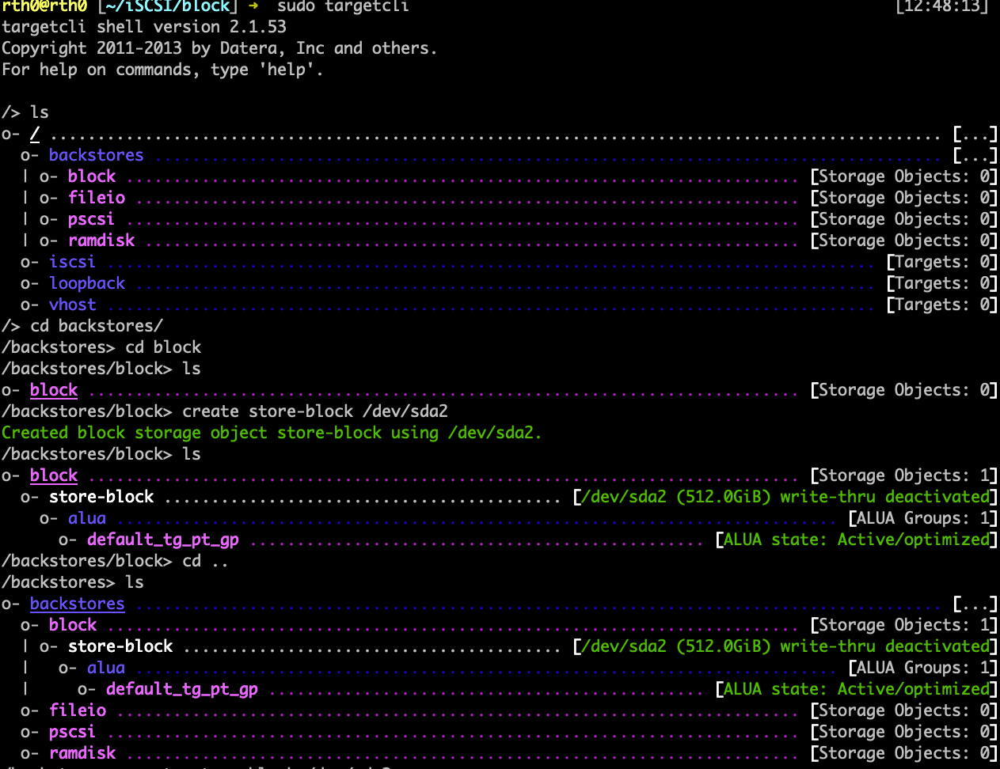


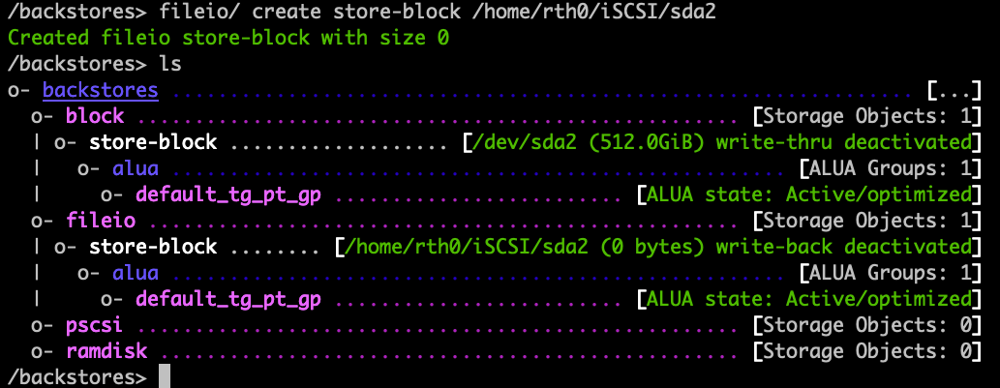

### 查看存储库

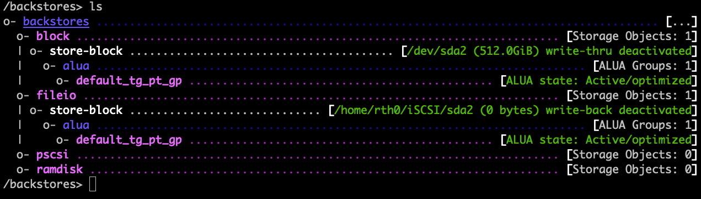

### 删除存储库

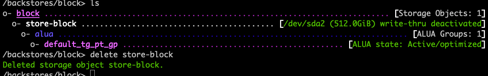

## 4、创建共享设备

### 创建共享名

> 共享名称必须符合 IQN 规范，即：iqn.xxx.yyy.zzz:共享名

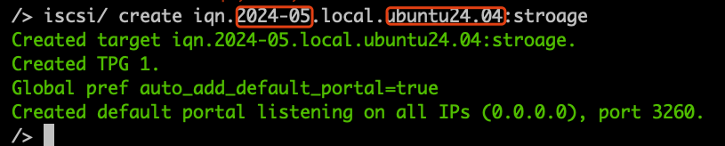

这里我创建了两个

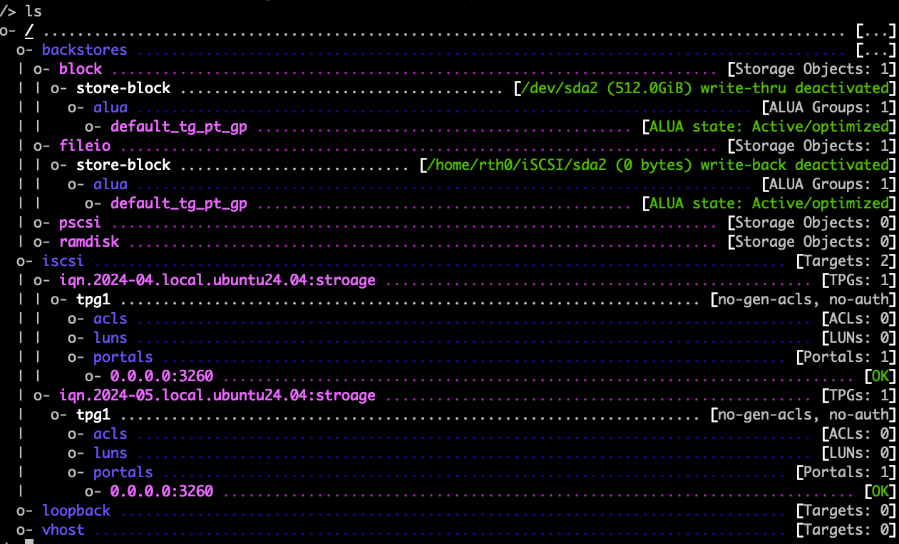

- tpg1：用户组
- acls：允许访问的客户端
- luns：允许访问的LUN
- portals：监听端口

### 创建访问策略

```bash
# 允许名称为client1的客户端访问
$ cd iscsi/iqn.2024-04.local.ubuntu24.04:stroage/tpg1/acls
$ create iqn.2024-04.local.ubuntu24.04 	#创建访问策略

client：只允许名称为 client 的客户端访问
```

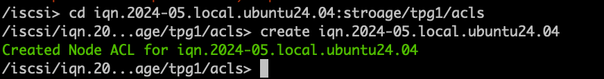

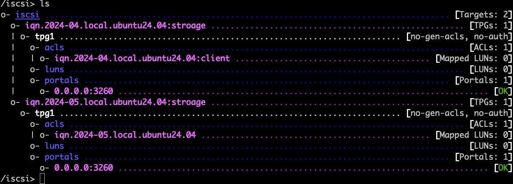

### 修改监听端口

```bash
$ cd /iscsi/iqn.2024-04.local.ubuntu24.04:stroage/tpg1/portals
$ delete 0.0.0.0 3260
$ create 0.0.0.0 3261
```

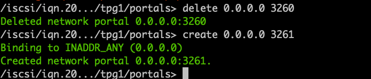

保存配置

```bash
$ exit
```

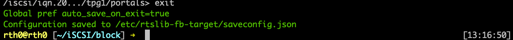

### 生效共享配置

```BASH
$ sudo systemctl restart targetclid

== 待验证 ==
$ sudo systemctl start target
$ sudo systemctl restart iscsid
```

## 5.删除共享设备

删除共享设备可以直接将 ***/iscsi*** 下的 iqn 共享删除即可，但是为了安全，建议按以下步骤执行删除操作：

- 在客户端卸载已挂载的 iSCSI 卷
- 删除 portals （如果使用非默认配置）
- 删除 LUN
- 删除 ACL
- 删除 IQN
- 删除 backstores 内容

## 6. iSCSI 客户端配置 --> Client


```bash
# 安装 iSCSI 工具包
# CentOS
$ yum install iscsi-initiator-utils -y

# deb
$ sudo apt install open-iscsi -y
```

### 修改iSCSI名称

> 需要将客户端名称设置为 ***iscsi/iqn.xxx.yyy.zzz:NAME/tpg1/acls/*** 中相同的名称
>
> Linux系统中修改

```BASH
$ vim /etc/iscsi/initiatorname.iscsi

InitiatorName=iqn.2024-04.local.ubuntu24.04:client
```

### 发现 iSCSI 目标

```bash
$ iscsiadm --mode discoverydb --type sendtargets --portal <-ip:port-> --discover
```

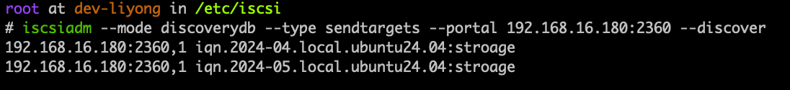

### 登录目标

```bash'
$ iscsiadm --mode node --targetname  iqn.2024-04.local.ubuntu24.04:stroage --portal <-ip:port-> --login
```


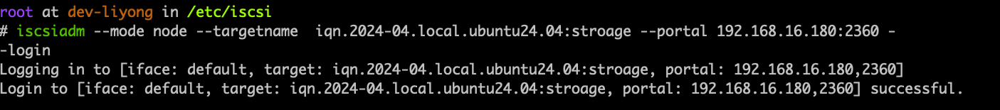

## 7.问题

客户端名称不符的情况

```bash
$ iscsiadm --mode node --targetname iqn.2024-01.local.debian12:storage --portal 192.168.10.122:3260 --login
Logging in to [iface: default, target: iqn.2024-01.local.debian12:storage, portal: 192.168.10.122,3260]
iscsiadm: Could not login to [iface: default, target: iqn.2024-01.local.debian12:storage, portal: 192.168.10.122,3260].
iscsiadm: initiator reported error (24 - iSCSI login failed due to authorization failure)
iscsiadm: Could not log into all portals
```

