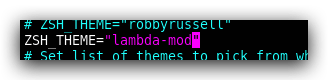

## 1. 环境配置

### 1.1 基础的工具安装

```bash
$ sudo dnf install zsh git curl -y
```

> 设置 默认终端 zsh

```bash
$ chsh -s /bin/zsh
```

### 1.2 安装 oh-my-zsh

| Method                                           | Command                                                      |
| :----------------------------------------------- | :----------------------------------------------------------- |
| **curl**                                         | `sh -c "$(curl -fsSL https://install.ohmyz.sh/)"`            |
| **wget**                                         | `sh -c "$(wget -O- https://install.ohmyz.sh/)"`              |
| **fetch**                                        | `sh -c "$(fetch -o - https://install.ohmyz.sh/)"`            |
| 国内curl[镜像](https://gitee.com/pocmon/ohmyzsh) | `sh -c "$(curl -fsSL https://gitee.com/pocmon/ohmyzsh/raw/master/tools/install.sh)"` |
| 国内wget[镜像](https://gitee.com/pocmon/ohmyzsh) | `sh -c "$(wget -O- https://gitee.com/pocmon/ohmyzsh/raw/master/tools/install.sh)"` |

### 1.2 主题安装

- https://github.com/hanmeimei222/mydotfiles/blob/master/lambda-mod.zsh-theme

- 将链接的主题放置到对应的目录下

- ```bash
  # 主题文件
  $ vim ~/.oh-my-zsh/themes/lambda-mod.zsh-theme
  
  # 修改主题
  $ vim ~/.zshrc 
  
  # 生效插件
  $ source ～/.bashrc
  ```

  


## 2. 插件推荐

### zsh -autosuggestions

```bash
$ cd ~/.oh-my-zsh/plugins/
$ git clone https://github.com/zsh-users/zsh-autosuggestions
```


[zsh-autosuggestions](https://github.com/zsh-users/zsh-autosuggestions) 是一个命令提示插件，当你输入命令时，会自动推测你可能需要输入的命令，按下右键可以快速采用建议。


### **zsh-syntax-highlighting**

```bash
$ cd ~/.oh-my-zsh/plugins/
$ git clone https://github.com/zsh-users/zsh-syntax-highlighting.git
```


[zsh-syntax-highlighting](https://github.com/zsh-users/zsh-syntax-highlighting) 是一个命令语法校验插件，在输入命令的过程中，若指令不合法，则指令显示为红色，若指令合法就会显示为绿色。


### z

`oh-my-zsh` 内置了 `z` 插件。`z` 是一个文件夹快捷跳转插件，对于曾经跳转过的目录，只需要输入最终目标文件夹名称，就可以快速跳转，避免再输入长串路径，提高切换文件夹的效率。


### extract

`oh-my-zsh` 内置了 `extract` 插件。`extract` 用于解压任何压缩文件，不必根据压缩文件的后缀名来记忆压缩软件。使用 `x` 命令即可解压文件.

### 启用插件

```
vim ~/.zshrc
plugins=(git zsh-autosuggestions zsh-syntax-highlighting z extract)
```


## 3. 卸载 Zsh

```bash
$ uninstall_oh_my_zsh
```


## 参考链接

- http://ohmyz.sh/
- [Zsh 前10 排行主题](https://www.slant.co/topics/7553/~theme-for-oh-my-zsh)
- [主题推荐](https://www.slant.co/topics/7553/~theme-for-oh-my-zsh)
- [开发环境推荐](https://github.com/hanmeimei222/mydotfiles/tree/master)