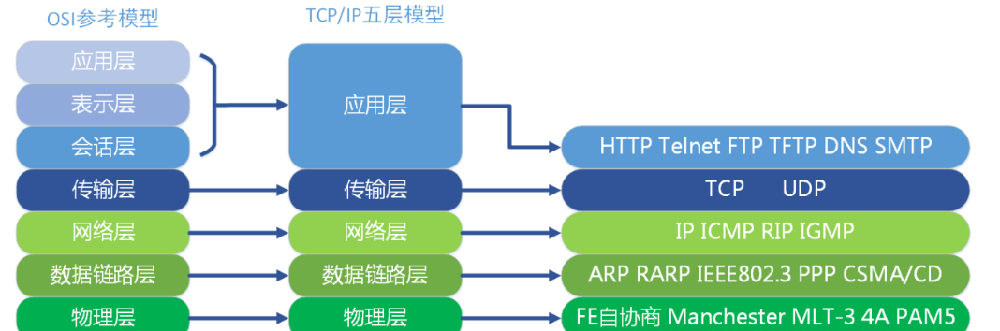
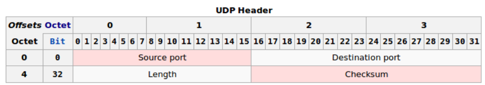

# UDP

## 什么是UDP？

UDP是User Datagram Protocol的简称，中文名是用户数据报协议，是OSI参考模型中的传输层协议，它是一种_**无连接的传输层协议**_，提供面向事务的简单不可靠信息传送服务，也就是说，当报文发送之后，是无法得知其是否是安全完整到达的，**UDP在第四层——传输层**。

### 特点:

#### **1. 面向无连接**

UDP 是不需要和 TCP 一样在发送数据之前进行三次握手建立连接的，想发送数据就可以发送，并且也只是数据报文的搬运工，不会对数据报文进行任何拆分和拼接操作。

- 在发送端，应用层将数据传递给传输层的 UDP 协议，UDP 只会给数据增加一个 UDP 头标识下的 UDP 协议，然后就将数据传递给网络层了。
- 在接收端，网络层将数据传递给传输层，UDP 只去除 IP 报文头就传递给应用层，不会进行任何拼接操作。

#### **2. 有单播、多播、广播的功能**

UDP 不止支持一对一的传输方式，同样支持一对多、多对多、多对一的方式，也就是说 UDP 提供了单播、多播、广播的功能。

#### **3. UDP 是面向报文的**

发送方的 UDP 对应用程序交下来的报文，在添加首部后就向下交付 IP 层。UDP 对应用程序交下来的报文，既不合并，也不拆分，而是保留这些报文的边界。因此，应用程序必须选择合适大小的报文。

#### **4. 不可靠性**

首先，不可靠性体现在无连接上，通信都不需要建立连接，想发就发。

并且收到什么数据就传递什么数据，同时也不会备份数据，发送数据也不会关心对方是否已经正确收到数据了。

再者网络环境时好时坏，但是 UDP 因为没有拥塞控制，一直会以恒定的速度发送数据。即使网络条件不好，也不会对发送速率进行调整。这样实现的弊端就是在网络条件不好的情况下可能会导致丢包，但是优点也很明显，在某些实时性要求很高的场景（比如，电话会议）就需要使用 UDP 而不是 TCP。

#### **5. 头部开销小，传输数据报文时是很高效的**

UDP 头部包含了一下几个数据：

- 两个十六位的端口号，分别是源端口（可选择段）和目标端口
- 整个数据报文的长度
- 整个数据报文的检验和（IPv4 可选 字段），该字段用于发现头部信息和数据中的错误

因此，UDP 的头部开销小，只有 8 字节，相比于 TCP 的至少 20 字节 要少的多，在传输数据报文的时候是很高效的。

## UDP 方式传输数据

发送时：先把数据放到报文，写到缓冲区字节数组再传送。
接收时：从缓冲器数组读取，打包到报文。

## UDP的单播、广播、组播

1. 单播：用于两个主机之间端对端的通信。即一对一（客户端与服务器端点到点连接）

2. 广播：用于一个主机对整个局域网上所有主机通信。即一对所有。广播禁止在Internet宽带网上传输（广播风暴）

3. 组播（多播）：对一组特定的主机进行通信，而不是整个局域网上的所有主机。即一对一组，将网络中同一业务类型主机进行了逻辑上的分组，进行数据收发的时候其数据仅仅在同一分组中进行，其他的主机没有加入此分组不能收发对应的数据

> 单播和广播是两个极端，要么对一个主机进行通信，要么对整个局域网上的主机进行通信。实际情况下，经常需要对一组特定的主机进行通信，而不是整个局域网上的所有主机，这就是组播的用途。
> 注意：只有UDP才有广播、组播的传递方式。而TCP是一对一连接通信。组播的重点是高效的把同一个包尽可能多的发送到不同的，甚至可能未知的设备。但是TCP连接是一对一明确的。