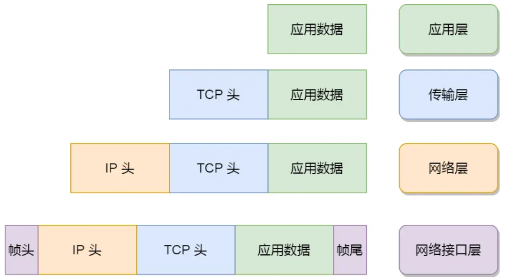

# 网络基础

## 网络交换方式

网络交换方式有三种:

- 电路交换( Circuit Switching )
- 分组交换 ( Packet Switching )
- 报文交换 ( Message Switching )

## _TCP/IP_ 网络模型有哪几层?

为什么要有 TCP/IP 网络模型？

同一个设备上的进程通行，有很多方式，比如有 管道、消息队列、共享内存、信号灯方式，而对于不同设备上的进程通信就需要网络通信，设备是多样的可能是手机，电脑，平板等，为了兼容多样的设备，就协商了一套`通用的网络协议`。

这个网络协议是分层的，每一层都有各自的作用和职责 -> [TCP/IP 网络模型 ] 

## 应用层

最上层的，也是我们能直接接触到的就是**应用层**（*Application Layer*）,电脑或手机使用的应用软件都是在**应用层**实现。

当两个手机发送微信消息的时候，(微信) 应用层 将数据传输给下一层，也就是**传输层**, 应用层只关注于为用户提供应用功能, 比如 HTTP、FTP、Telnet、DNS、SMTP等。

应用层是不用去关心数据是如何传输的,就比如我想喝水，至于烧水的过程是谁我不关心。

而且应用层是工作在操作系统中的`用户态`，传输层及以下则工作在`内核态`。

## 传输层

传输层的设计理念是简单、高效、专注

应用层的数据包会传给传输层，**传输层**（*Transport Layer*）是为应用层提供网络支持的。

在传输层会有两个传输协议，分别是 TCP 和 UDP。

**TCP** 的全称叫传输控制协议（*Transmission Control Protocol*）

**UDP** 的全称是用户数据报协议（_User Datagram Protocol_）

大部分应用使用的正是 TCP 传输层协议，比如 HTTP 应用层协议。TCP 相比 UDP 多了很多特性，比如流量控制、超时重传、拥塞控制等，这些都是为了保证数据包能可靠地传输给对方。

UDP 相对来说就很简单，简单到只负责发送数据包，不保证数据包是否能抵达对方，但它实时性相对更好，传输效率也高。当然，UDP 也可以实现可靠传输，把 TCP 的特性在应用层上实现就可以，不过要实现一个商用的可靠 UDP 传输协议。

应用需要传输的数据可能会非常大，如果直接传输就不好控制，因此当传输层的数据包大小超过 MSS（TCP 最大报文段长度） ，就要将数据包分块，这样即使中途有一个分块丢失或损坏了，只需要重新发送这一个分块，而不用重新发送整个数据包。在 TCP 协议中，我们把每个分块称为一个 **TCP 段**（*TCP Segment*）。

当设备作为接收方时，传输层则要负责把数据包传给应用，但是一台设备上可能会有很多应用在接收或者传输数据，因此需要用一个编号将应用区分开来，这个编号就是**端口**。

## 网络层

我们不希望传输层协议处理太多的事情，只需要服务好应用即可，让其作为应用间数据传输的媒介，帮助实现应用到应用的通信，而实际的传输功能就交给下一层，也就是**网络层**（*Internet Layer*）。

网络层最常使用的是 IP 协议（*Internet Protocol*），IP 协议会将传输层的报文作为数据部分，再加上 IP 包头组装成 IP 报文，如果 IP 报文大小超过 MTU（以太网中一般为 1500 字节）就会**再次进行分片**，得到一个即将发送到网络的 IP 报文。

我们一般用 IP 地址给设备进行编号，对于 IPv4 协议， IP 地址共 32 位，分成了四段（比如，192.168.100.1）

IP 地址分成两种意义：

- 一个是**网络号**，负责标识该 IP 地址是属于哪个「子网」的；
- 一个是**主机号**，负责标识同一「子网」下的不同主机；

一般来说需要配合**子网掩码**才能算出 IP 地址 的网络号和主机号。

比如 10.100.122.0/24，后面的`/24`表示就是 `255.255.255.0` 子网掩码，255.255.255.0 二进制是 [11111111-11111111-11111111-00000000] 为了简化子网掩码的表示，用/24代替255.255.255.0。将 10.100.122.2 和 255.255.255.0 进行**按位与运算**，就可以得到网络号，如下图

- [ip计算器  (ipjisuanqi.com)](https://ipjisuanqi.com/)

除了寻址能力， IP 协议还有另一个重要的能力就是**路由**。实际场景中，两台设备并不是用一条网线连接起来的，而是通过很多网关、路由器、交换机等众多网络设备连接起来的，那么就会形成很多条网络的路径，因此当数据包到达一个网络节点，就需要通过路由算法决定下一步走哪条路径。

路由器寻址工作中，就是要找到目标地址的子网，找到后进而把数据包转发给对应的网络内。

所以，**IP 协议的寻址作用是告诉我们去往下一个目的地该朝哪个方向走，路由则是根据「下一个目的地」选择路径。寻址更像在导航，路由更像在操作方向盘**。

## 网络接口层

生成了 IP 头部之后，接下来要交给**网络接口层**（*Link Layer*）在 IP 头部的前面加上 MAC 头部，并封装成数据帧（Data frame）发送到网络上。

网络接口层主要为网络层提供「链路级别」传输的服务，负责在以太网、WiFi 这样的底层网络上发送原始数据包，工作在网卡这个层次，使用 MAC 地址来标识网络上的设备。

## TCP 和 UDP 的区别

|   特征点   |     TCP      |    UDP     |
| :--------: | :----------: | :--------: |
| 传输可靠性 |   面向连接   | 面向非连接 |
|  应用场景  | 传输数据量大 |  传输量小  |
|    速度    |      慢      |     快     |

## TCP 和 UDP 的比较

|     UDP      |                     TCP                     |                                        |
| :----------: | :-----------------------------------------: | :------------------------------------: |
|   是否连接   |                   无连接                    |                面向连接                |
|   是否可靠   |    不可靠传输，不适用流量控制和拥塞控制     |    可靠传输，使用流量控制和拥塞控制    |
| 连接对象个数 | 支持一对一、一对多、多对一和多对多交互通信  |            只能是一对一通信            |
|   传输方式   |                  面向报文                   |               面向字节流               |
|   首部开销   |                 首部开销小                  |     首部最小 20 字节，最大 60 字节     |
|   适用场景   | 适用于实时应用（IP 电话、视频会议、直播等） | 适用于要求可靠传输的应用，例如文件传输 |

- TCP 向上层提供面向连接的可靠服务，UDP 向上层提供无连接的不可靠服务
- 虽然 UDP 并没有 TCP 传输来的准确，但是也能在很多实时性要求较高的地方有所作为
- 对数据准确性要求高，速度可以相对较慢的，可以选用 TCP

## 总结

TCP/IP 网络通常是由上到下分成 4 层，分别是**应用层，传输层，网络层和网络接口层**。

封装格式：

网络接口层的传输单位是帧（frame），IP 层的传输单位是包（packet），TCP 层的传输单位是段（segment），HTTP 的传输单位则是消息或报文（message）。但这些名词并没有什么本质的区分，可以统称为数据包。