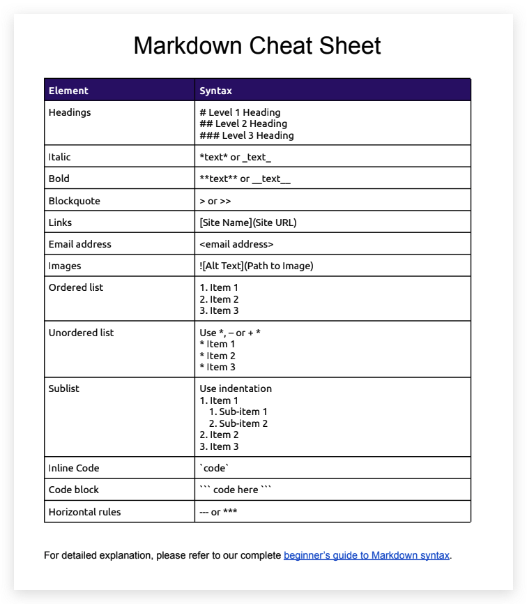
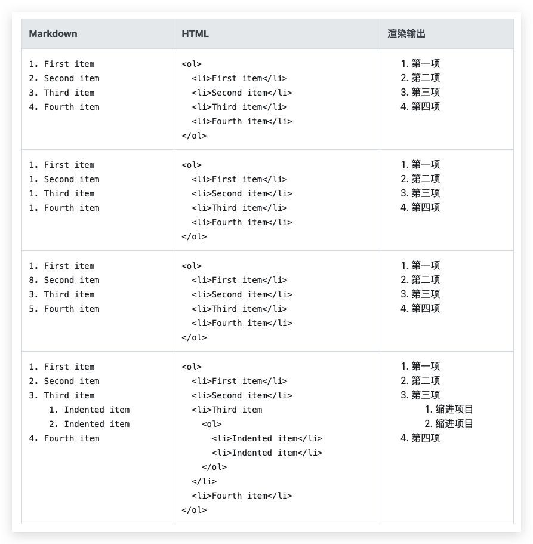
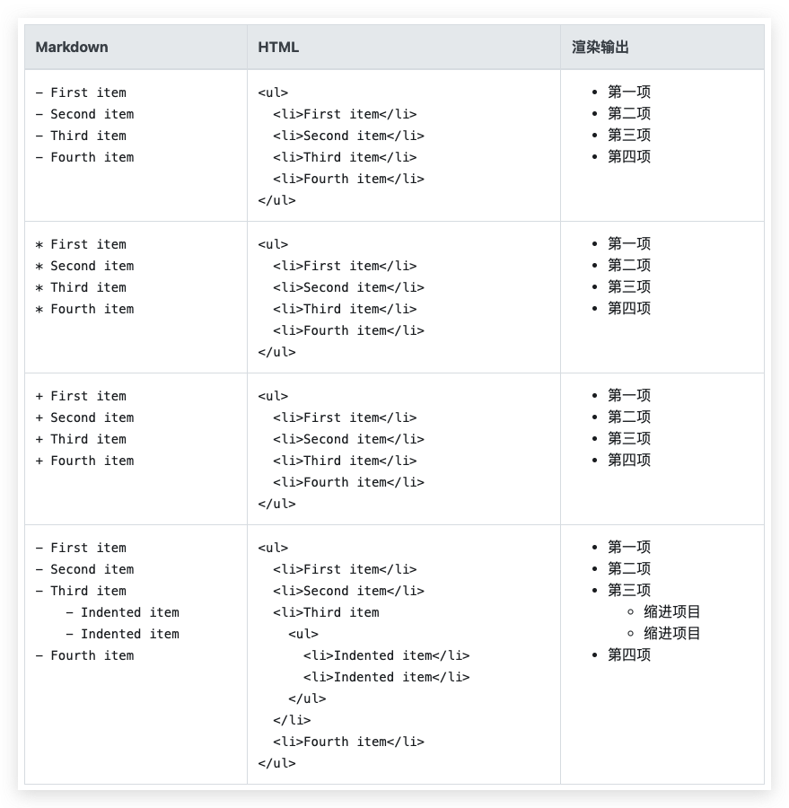
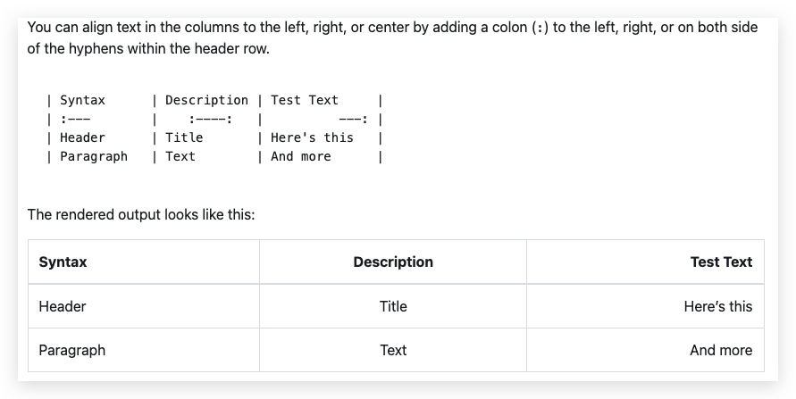

## 标题

| Markdown                 | HTML                       | 渲染输出   |
| ------------------------ | -------------------------- | ---------- |
| `# Heading level 1`      | `<h1>Heading level 1</h1>` | 标题级别 1 |
| `## Heading level 2`     | `<h2>Heading level 2</h2>` | 标题级别 2 |
| `### Heading level 3`    | `<h3>Heading level 3</h3>` | 标题级别 3 |
| `#### Heading level 4`   | `<h4>Heading level 4</h4>` | 标题级别 4 |
| `##### Heading level 5`  | `<h5>Heading level 5</h5>` | 标题级别 5 |
| `###### Heading level 6` | `<h6>Heading level 6</h6>` | 标题级别 6 |

### 替代语法

或者，在文本下方的行中，添加任意数量的`==`1 级标题字符或`--`2 级标题字符。

| Markdown                         | HTML                       | 渲染输出   |
| -------------------------------- | -------------------------- | ---------- |
| `Heading level 1===============` | `<h1>Heading level 1</h1>` | 标题级别 1 |
| `Heading level 2---------------` | `<h2>Heading level 2</h2>` | 标题级别 2 |


## 字体样式

```
用 星号,下划线 来显示 *斜体*, _斜体_

用星号来显示 **加粗**

用下划线来显示 __加粗__
```

用星号,下划线来显示 *斜体*, _斜体_

用星号,下划线来显示 **加粗**,__加粗__


## 复选框

```markdown
- [ ] content
- [x] content

# - + * 效果相同
```

- [ ] content
- [x] content


## 水平线

```markdown
---

***

- - - 
```


## 块引用

```markdown
> 块引用

>> 再次块引用

>>> 
```

> 块引用

>> 再次块引用


## **添加图片**

```markdown

```




## 列表

### 有序列表




### 无序列表



## 表格

### 合并表格推荐

```html
<table>
    <tr>
        <th>班级</th><th>课程</th><th>平均分</th>
    </tr>
    <tr>
        <td rowspan="3">1班</td>
      	<td>语文</td><td>95</td>
    </tr>
    <tr>
        <td>数学</td><td>96</td>
    </tr>
    <tr>
        <td>英语</td><td>92</td>
    </tr>
</table>
```

<table>
    <tr>
        <th>班级</th><th>课程</th><th>平均分</th>
    </tr>
    <tr>
        <td rowspan="3">1班</td>
      	<td>语文</td><td>95</td>
    </tr>
    <tr>
        <td>数学</td><td>96</td>
    </tr>
    <tr>
        <td>英语</td><td>92</td>
    </tr>
</table>

### markdown语法表格

```markdown
|班级|课程|平均分|
|---|---|---|
|1班|语文|92|
|2班|语文|95|
|3班|语文|91|
```

|班级|课程|平均分|
|---|---|---|
|1班|语文|92|
|2班|语文|95|
|3班|语文|91|

### 高级语法




## 参考链接：

- https://www.markdownguide.org/
- 基础语法：https://www.markdownguide.org/basic-syntax/

- https://www.markdownguide.org/extended-syntax/
