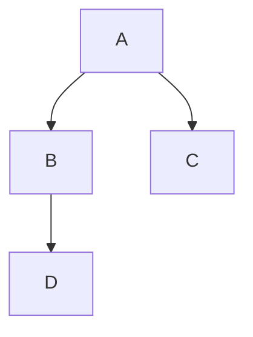
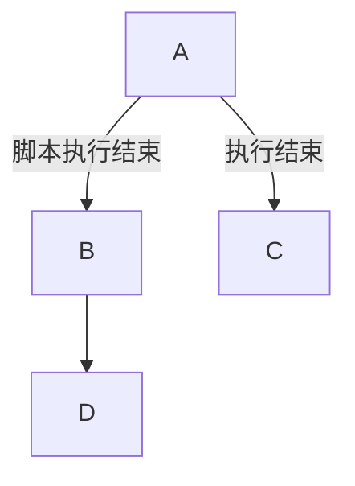
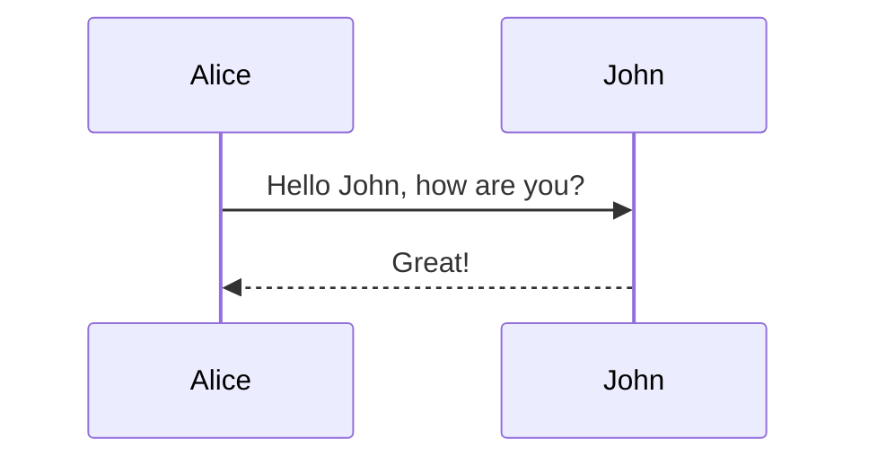
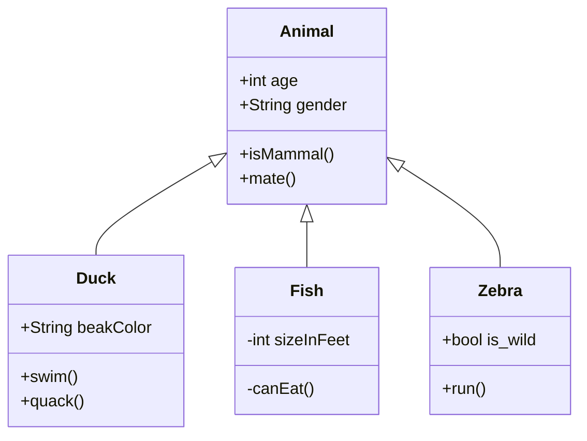
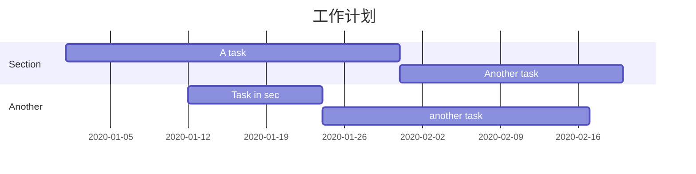
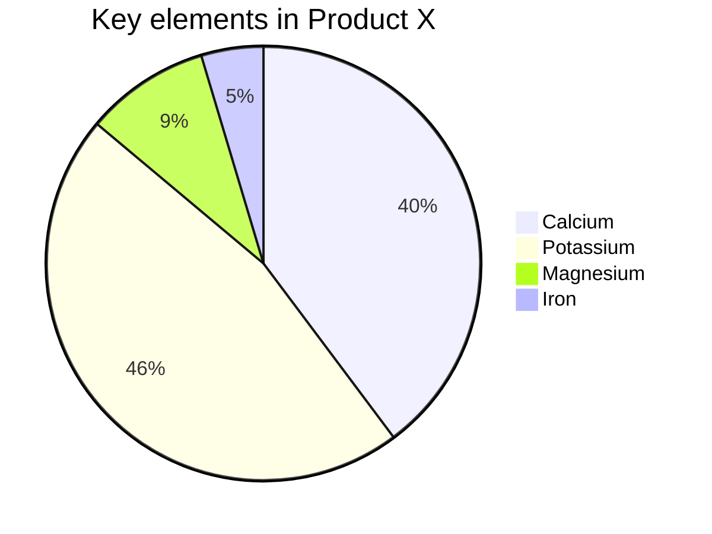

# Typora Mermaid

类图、流程图、时序图

### **Mermaid**

**Mermaid[1]** 是一种简单的类似 Markdown 的脚本语言，通过 JavaScript 编程语言，将文本转换为图片。因此，真正实现画图功能的并不是 Typora 本身，它只是内置了对 Mermaid 的支持。

先在 Typora 中，输入 **```mermaid** 然后敲击回车，即可初始化一张空白图。

### 流程图

```
graph TD;
    A-->B;
    A-->C;
    B-->D;
```








### **时序图**

语法解释：`->>` 代表实线箭头，`-->>` 则代表虚线。

```
sequenceDiagram
    Alice->>John: Hello John, how are you?
    John-->>Alice: Great!
```



### **状态图**

语法解释：`[*]` 表示开始或者结束，如果在箭头右边则表示结束。

```
stateDiagram
    [*] --> s1
    s1 --> [*]
```


### **类图**

语法解释：`<|--` 表示继承，`+` 表示 `public`，`-` 表示 `private`，学过 Java 的应该都知道。

```
classDiagram
      Animal <|-- Duck
      Animal <|-- Fish
      Animal <|-- Zebra
      Animal : +int age
      Animal : +String gender
      Animal: +isMammal()
      Animal: +mate()
      class Duck{
          +String beakColor
          +swim()
          +quack()
      }
      class Fish{
          -int sizeInFeet
          -canEat()
      }
      class Zebra{
          +bool is_wild
          +run()
      }
```



### **甘特图**

甘特图一般用来表示项目的计划排期，目前在工作中经常会用到。

语法也非常简单，从上到下依次是图片标题、日期格式、项目、项目细分的任务。

```
gantt
    title 工作计划
    dateFormat  YYYY-MM-DD
    section Section
    A task           :a1, 2020-01-01, 30d
    Another task     :after a1  , 20d
    section Another
    Task in sec      :2020-01-12  , 12d
    another task      : 24d

```



### **饼图**

饼图使用 `pie` 表示，标题下面分别是区域名称及其百分比。

```
pie
    title Key elements in Product X
    "Calcium" : 42.96
    "Potassium" : 50.05
    "Magnesium" : 10.01
    "Iron" :  5
```




