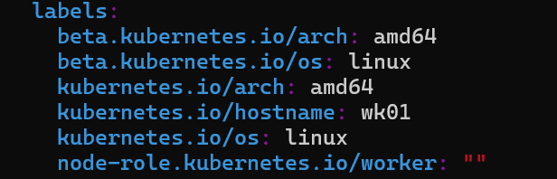

# Sealos 安装Kubernetes 

### 网段规划

| 网段类型       | 网段           | 其他 |
| -------------- | -------------- | ---- |
| 主机网段       | 192.168.1.0/24 |      |
| 预留软 lb 网段 | 192.168.1.0/24 |      |
| svc 网段       | 10.3.0.0/8     |      |
| pod 网段       | 10.4.0.0/8     |      |

## 操作系统部署(RockyLinux 9)

**内核如下**

```bash
[root@ms01 ~]# uname -r
5.14.0-362.8.1.el9_3.x86_64
[root@ms01 ~]# uname -a
Linux ms01 5.14.0-362.8.1.el9_3.x86_64 #1 SMP PREEMPT_DYNAMIC Wed Nov 8 17:36:32 UTC 2023 x86_64 x86_64 x86_64 GNU/Linux
```

**主机机名**

```
ms01 192.168.16.49
```


## 内核设置

```bash
# 网卡设置
$ grubby --update-kernel=ALL --args=net.ifnames=0
$ grubby --update-kernel=ALL --args=biosdevname=0

# 关闭 selinux
$ grubby --update-kernel=ALL --args=selinux=0

# 关闭 ipv6 转发
$ grubby --update-kernel=ALL --args=ipv6.disable=1
```

## **更换源**

内网

```bash
$ cp -rpf /etc/yum.repos.d /etc/yum.repos.d.bak

$ sudo sed -e 's|^mirrorlist=|#mirrorlist=|g' \
         -e 's|^#baseurl=http://dl.rockylinux.org/$contentdir|baseurl=https://mirrors.cernet.edu.cn/rocky|g' \
         -i.bak \
         /etc/yum.repos.d/*.repo

# epel 源
$ dnf install -y epel-release

$ sed -e 's!^metalink=!#metalink=!g' \
    -e 's!^#baseurl=!baseurl=!g' \
    -e 's!https\?://download\.fedoraproject\.org/pub/epel!https://mirrors.cernet.edu.cn/epel!g' \
    -e 's!https\?://download\.example/pub/epel!https://mirrors.cernet.edu.cn/epel!g' \
    -i /etc/yum.repos.d/epel*.repo
```

### 安装基础软件

```bash
$ dnf update -y
$ dnf install vim chrony bash-completion tar nfs-utils jq wget -y
$ dnf clean all
```

## ntp | chrony 时间对时

```
pool time1.aliyun.com iburst
pool time2.aliyun.com iburst
pool time3.aliyun.com iburst
```

## 关闭防火墙

```bash
$ systemctl disable firewalld --now
```

# sealos 下载

[官网]:https://sealos.io/zh-Hans/docs/self-hosting/lifecycle-management/quick-start/install-cli

[ Github ]: [GitHub - labring/sealos at v4.3.7](https://github.com/labring/sealos/tree/v4.3.7)


## 二进制手动安装

```bash
# 获取版本列表
$ https://sealos.io/zh-Hans/docs/self-hosting/lifecycle-management/quick-start/install-cli
```

> 注意：在选择版本时，建议使用稳定版本例如 `v4.3.0`。像 `v4.3.0-rc1`、`v4.3.0-alpha1` 这样的版本是预发布版，请谨慎使用。这里使用： v4.3.7

### 指定版本下载

```bash
$ VERSION="4.3.7"
$ wget https://github.com/labring/sealos/releases/download/v${VERSION}/sealos_${VERSION}_linux_amd64.tar.gz
```

> 如果下载不下来直接去 github 上下载到本地上传

### 解压安装

```bash
$ tar zxvf sealos_${VSERSION}_linux_amd64.tar.gz sealos
$ chmod +x sealos && mv sealos /usr/bin
```

## 包管理器安装

#### deb 源

```bash
$ echo "deb [trusted=yes] https://apt.fury.io/labring/ /" | sudo tee /etc/apt/sources.list.d/labring.list
$ sudo apt update
$ sudo apt install sealos
```

#### RPM 源

```bash
$ sudo cat > /etc/yum.repos.d/labring.repo << EOF
[fury]
name=labring Yum Repo
baseurl=https://yum.fury.io/labring/
enabled=1
gpgcheck=0
EOF
$ sudo yum clean all
$ sudo yum install sealos
```

### 检查安装

```bash
$ sealos version
SealosVersion:
  buildDate: "2023-10-30T16:19:05Z"
  compiler: gc
  gitCommit: f39b2339
  gitVersion: 4.3.7
  goVersion: go1.20.10
  platform: linux/amd64
```

# 安装 K8S 集群

## 部署版本

| 组件名称   | 组件版本 | 说明                                               |
| ---------- | -------- | -------------------------------------------------- |
| Sealos-cli | 4.3.7    |                                                    |
| k8s        | v1.28.7  | 镜像： docker.io/labring/kubernetes:v1.27.11-4.3.7 |
| cilium     | v1.14.7  | 镜像： docker.io/labring/cilium:v1.14.7            |
| helm       | v3.14.1  | 镜像： docker.io/labring/helm:v3.14.1              |
| nerdctl    | v1.7.0   | 镜像： docker.io/labring/nerdctl:v1.7.0            |

## 下载 Sealos 的离线安装包

```bash
# 下载镜像
$ sealos pull docker.io/labring/kubernetes:v1.27.11-4.3.7
$ sealos pull docker.io/labring/cilium:v1.14.7
$ sealos pull docker.io/labring/helm:v3.14.1
$ sealos pull docker.io/labring/nerdctl:v1.7.0

# 导出镜像 (可以不用,可以使用有外网的集群推送到registory仓库指定仓库拉取)
$ sealos save -o kubernetes.tar docker.io/labring/kubernetes:v1.27.11-4.3.7

# 导入镜像并安装
sealos load -i kubernetes.tar

# 查看集群镜像是否导入成功
$ sealos images 


# 查看下载的镜像
$ sealos images
REPOSITORY                     TAG              IMAGE ID       CREATED        SIZE
docker.io/labring/kubernetes   v1.27.11-4.3.7   6d78fa2599a8   2 days ago     596 MB
docker.io/labring/helm         v3.14.1          5658581e430c   3 weeks ago    50.7 MB
docker.io/labring/cilium       v1.14.7          d26329e9fb5c   3 weeks ago    664 MB
docker.io/labring/nerdctl      v1.7.0           5ca753f28e0e   3 months ago   172 MB

# 安装单节点的 K8s
# sealos version must >= v4.1.0
$ sealos run \
	\
	docker.io/labring/kubernetes:v1.27.11-4.3.7 \
	docker.io/labring/helm:v3.14.1 \
	docker.io/labring/cilium:v1.14.7 \
	docker.io/labring/nerdctl:v1.7.0 \
	\
	--port=22 \
	--user="root"
	--pk="/root/.ssh/id_rsa" \
	\
	--masters 192.168.1.49
```

## 安装结束后设置自动补全

```bash
# 设置自动补全
{
    echo 'source <(kubectl completion bash)';
    echo 'alias k=kubectl';
    echo 'complete -o default -F __start_kubectl k';
} >> ~/.bashrc

```

### 插件

> TODO 部署 krew 插件，方便命令行运维

```
export KREW_ROOT=/opt/krew
export PATH=${KREW_ROOT}/bin${PATH:+:${PATH}}
```

# sealos 命令补充

```bash
# 增加 K8s 节点
sealos add --nodes 192.168.1.57

# 增加 master 节点
sealos add --masters 192.168.1.24,192.168.1.25

# 删除 K8s 节点
# 删除 node 节点
$ sealos delete --nodes 192.168.1.47

# 删除 master 节点
sealos delete --masters 192.168.1.24

# 清空 K8s 集群
$ sealos reset

# 导出镜像
$ sealos save -o kubernetes.tar registry.cn-shanghai.aliyuncs.com/labring/kubernetes:v1.27.7

# 导入镜像
$ sealos load -i kubernetes.tar

# 不导入直接用离线包安装安装
$ sealos run kubernetes.tar
```

## 节点类型及标签

```
# node-role.kubernets.io/<role>=""
```

