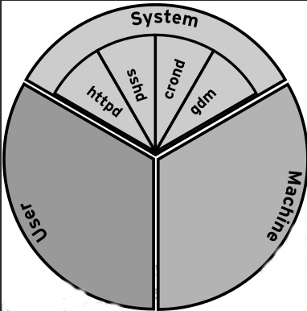
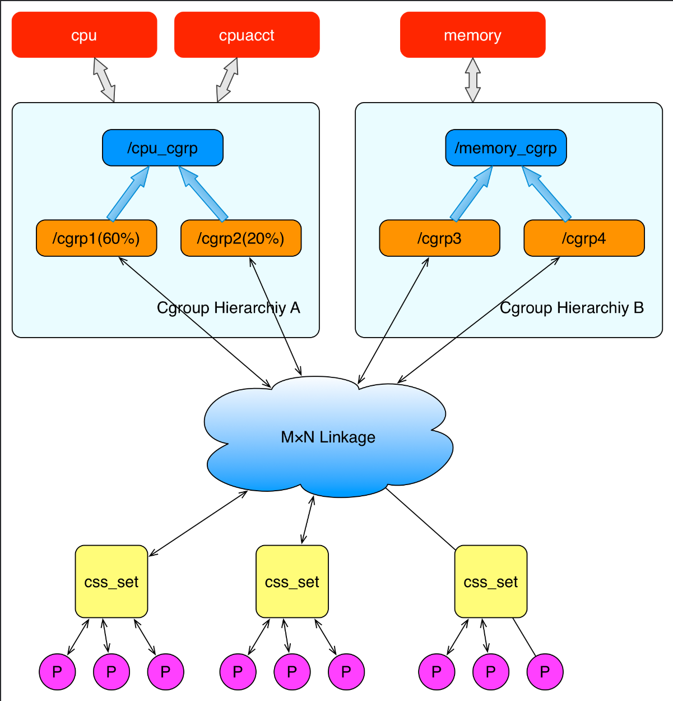
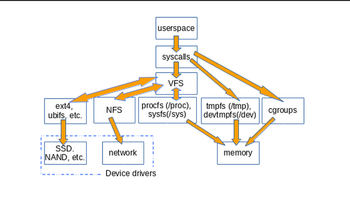
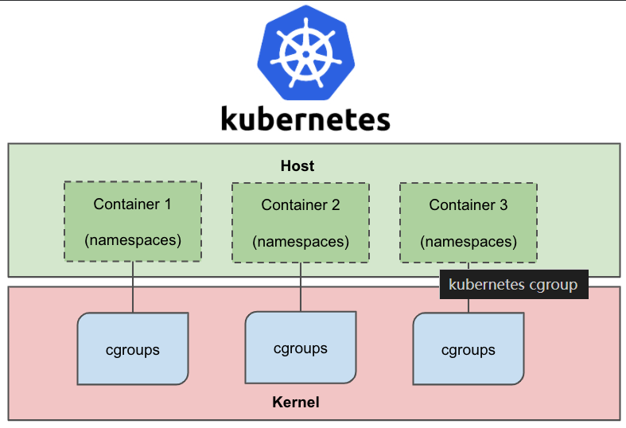
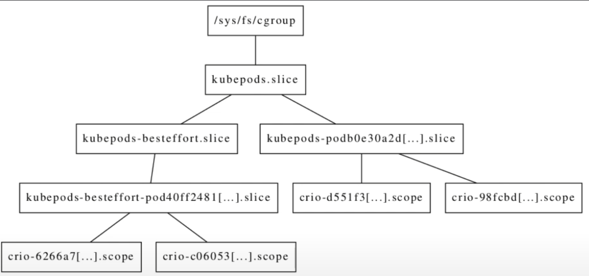
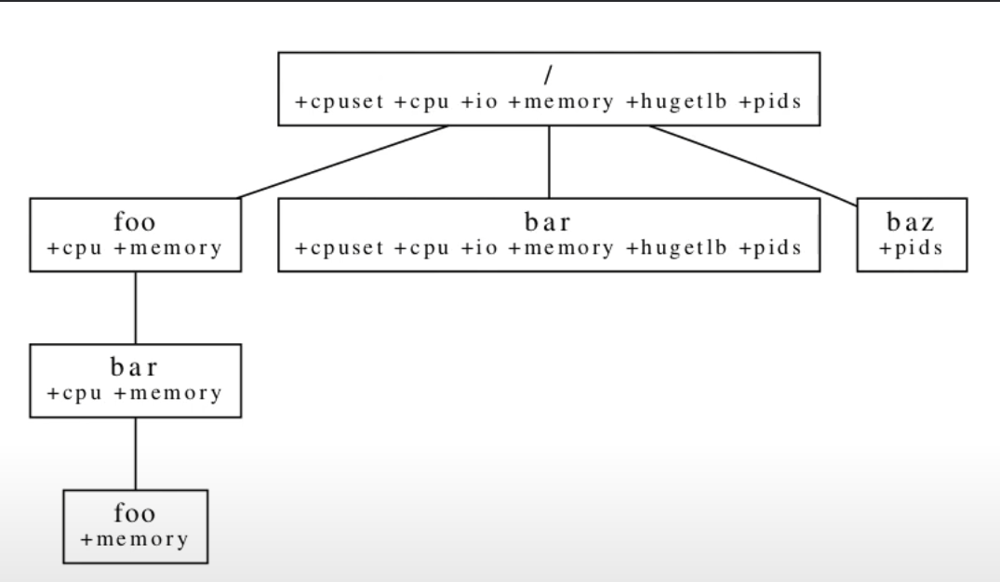

# Control Group v2

"cgroup" 是 "control group" 的缩写。

## cgroup 的由来

Google 的工程师(Paul Menage 和 Rohit Seth)，在2016年发起，最早名称为进程容器(process containers)。在2007年，因为在Linux内核中，容器(container)这个名词有许多不同的意义，为了避免混乱，被重新命名为cgroup，并且被合并到2.6.24版本的内核中。


## cgroup 是什么？

cgroup 是 Linux 内核的一个功能，用来限制、控制与分离一个进程组的资源(如 CPU、内存、磁盘输出输出等)，

cgroup 是一种以 树状层级 方式组织进程的机制，以及在层级钟以受控和可配置的方式分发系统资源。

### cgroup 的组成部分

**核心(core)** ：主要负责层级化组织进程

**控制器(controllers)** : 大部分的控制器负责 cgroup 层级中特定类型的系统资源的分配，少部分 uitility 控制器用于其它目的。

### 进程 | 线程与 cgroup 关系

所有 cgroup 组成一个**树形结构**（tree structure），

- 系统中的**每个进程都属于且只属于**某一个 cgroup；
- 一个**进程的所有线程**属于同一个 cgroup；
- 创建子进程时，继承其父进程的 cgroup；
- 一个进程可以被**迁移**到其他 cgroup；
- 迁移一个进程时，**子进程（后代进程）不会自动**跟着一起迁移；

###  cgroup 提供什么？

- 资源限制：组可以被设置内存限制，包括虚拟内存。
- 优先级：一些组优先会得到大量的CPU或磁盘IO吞吐量
- 结算：用来度量现在的资源占用情况
- 控制：冻结组或检查点和重启

## 为什么会有 cgroup

在 Linux 中，一直依赖就有对进程进行分组的概念和需求，比如 `session group`, `progress group` 等，后来随着人们对这方面的需求越来越多，比如需要追踪一组进程的内存和IO 使用情况等，于是出现了cgroup，用来统一将进程进行分组，并在分组的基础上对进程进行监控和资源控制管理等。

在 `CentOS 7` 中，通过将cgroup层级系统与systemd单位树捆绑， 可以把资源管理设置从进程级别移至应用程序级别。默认情况下，systemd 会自动创建 `slice`、`scope`和`service`单位的层级，来为 cgroup 树提供统一结构，可以通过 `systemctl` 命令创建自定义slice进一步修改结构。



如上图所示，系统默认创建了3个顶级`slice`(`System`,`User`和`Machine`)。每个slice都会获得相同CPU使用时间，如果`user.slice`想要获得`100%`的CPU使用时间，而此时CPU比较空闲，那么`user.slice`就能如愿以偿。

## 为什么还需要 cgroup2 

cgroup v1 支持多个 hierarchy，每个hierarchy可以启用任意数量的controller。这种方式看上去高度灵活，但实际中并不是很有用。例如：

1. utility 类型的 controller（例如freezer）本可用与多个hierarchy，而由于v1中每个controller只有一个实例，utility controller的作用就大打折扣；而hierarchy 一旦被populated之后，控制器就不能移动到其他hierarchy的事实，更是加剧了这个问题。
2. 另一个问题是，关联到某个hierarchy的所有控制器，只能拥有相同的hierarchy视图。无法在controller粒度改变这种视图。
3. 

在实际中，大部分 hierarhchy 都启动了所有控制器，而实际上只有联系非常紧密的控制器——例如 cpu 和 cpuacct 放到同一个 hierarchy 中才有意义。最终结果是：

1. 用户控件最后管理这多个非常类似的 hierarchy
2. 在执行 hierarchy 管理操作是，每个 hierarchy 上重复着相同的操作。

### 其他 cgroup 接口相关问题

v1 的设计并没有前瞻性，因此后面引入了大量怪异特性和不一致性。

### cgroupV2的功能

cgroup v2 将多个 hierarchy 的方式变成了 unified hierarchy，并将所有的controller 挂载到一个 unified hierarchy。

当前kernel没有一处 cgroup v1版本，允许 cgroup v1 和 v2 共存，但是相同的 controller 不能同时 mount 到这两个不同的 cgroup 版本中。

> 进程能否是同时属于cgroup v1和cgroup v2？可以的，查看 `/proc/$PID/cgroup` 会返现同时包含v1和v2 membership


### 控制器

可以选择性地针对一个cgroup启用或禁用某些控制器；

控制器的所有行为是hierarchical的。

- 如果一个cgroup启用了某个控制器，它的sub-hierarchy中所有进程都会受控制
- 如果在更接近的root的节点上设置了资源限制，那下面的sub-hierarchy是无法覆盖也，也就是sub-hierarchy受parent限制。

## 基础操作

> 挂载

```bash
$ mount -tl cgroup2 none $MOUNT_PORINT
```

cgroupv2 文件系统的 magic number 是`0x63677270`（“cgrp”）

- 所有支持v2且未绑定到v1的控制器，会被自动绑定到v2的hierarchy，出现在root层级中。
- v2中未使用的控制器也可以绑定到其他的hierarchies。

这说明我们能以完全向后兼容的方式混用v2和v1 hierarchy。

### 组织进程和线程

#### 进程：创建/删除/移动/查看 cgroup

初始状态下，只有root cgroup，所有进程都属于这个cgroup。

- 创建sub-cgroup：只需要创建一个子目录

- ```bash
  $ mkdir $CGROUP_NAME
  ```

- 将进程移动到指定cgroup：将PID写入到相应cgroup的cgroup.procs文件即可。
  - 每次`write(2)`只能迁移一个进程
  - 如果进程有多个线程，那将任意线程PID写入到文件，都会将该进程的所有线程迁移到相应的cgroup。
  - 如果进程fork出一个子进程，那子进程属于执行fork操作时父进程所属的cgroup。
  - 进程退出（exit）后，仍然留在退出时它所属的cgroup，直到这个进程被收割（reap）；
  - 僵尸进程不会出现在cgroup.procs中，因此无法对僵尸进程执行迁移操作。
- 删除cgroup/sub-cgroup
  - 如果一个cgroup 已经没有任何children或活进程，那直接删除对应的文件夹就删除该cgroup了
  - 如果一个cgroup已经没有children，但是还有僵尸进程，也认为这个cgroup是空的，可以直接删除
- 查看进程的cgroup信息：`cat /proc/$PID/cgroup` 会列出该进程的 cgroup membership。如果启用了v1，这个文件可能会包含多行，每个hierarchy一行。v2对应的行永远是0::$PATH格式：

```bash
$ cat /proc/$$/cgroup # ubuntu 20.04 上的输出，$$ 是当前 shell 的进程 ID
12:devices:/user.slice
11:freezer:/
10:memory:/user.slice/user-1000.slice/session-1.scope
9:hugetlb:/
8:cpuset:/
7:perf_event:/
6:rdma:/
5:pids:/user.slice/user-1000.slice/session-1.scope
4:cpu,cpuacct:/user.slice
3:blkio:/user.slice
2:net_cls,net_prio:/
1:name=systemd:/user.slice/user-1000.slice/session-1.scope
0::/user.slice/user-1000.slice/session-1.scope  # v2

```

#### 线程

- cgroup v2 的一部分控制器支持线程粒度的资源控制，这种控制器称为threaded controllers。
  - 默认情况下，一个进程的所有线程属于同一个cgroup，
  - 线程模型使我们能将不同线程放到subtree的不同位置，同时还能保持二者在同一个资源域（resource domain）内。
- 不支持线程模型的控制器称为domain controllers。

将cgroup改成threaded模式（单向/不可逆操作） cgroup 创建之后都是domain cgroup，可以通过下面的命令将其改成threaded模式

```bash
$ echo threaded > cgroup.type
```

### 控制器

- CPU
- Memory
- IO
- PID
- Cpuset
- Device Controller（基于cgroup BPF）
- RDMA
- HugeTLB
- Misc
  - perf_event

### cgroup 命名控件（cgroupns）

容器环境中用cgroup和其他一些namespace来隔离进程，但是`/proc/$PID/cgroup` 文件可能会泄露潜在的系统层信息。例如：

```bash
cat /proc/self/cgroup
0::/batchjobs/container_id1 # <-- cgroup 的绝对路径，属于系统层信息，不希望暴露给隔离的进程
```

因此引入了cgroup namespace。

## cgroupV2的实现

> cgroup 控制接口



Linux 使用了多种数据结构在内核中实现了cgroups的配置，关联了进程和cgroups节点，那么Linux又是如何让用户态进程使用cgroups的功能呢？Linux内核有一个很大的模块叫VFS（Virtual File System）。VFS能够把具体的文件系统细节隐藏起来，给用户态进程提供一个同一个为文件系统API接口。cgrpus与CFS之间衔接的部分称之为cgroup文件系统。

## cgroupV2的典型应用

听说cgroup是从docker开始，也是容器技术带火了cgroup技术，这里简单介绍下容器如何使用cgroup








**参考文档**:

- https://arthurchiao.art/blog/cgroupv2-zh/
- https://www.wikiwand.com/zh-hans/Cgroups
- https://segmentfault.com/a/1190000040980305
- https://juejin.cn/post/6844904110639054861
- https://icloudnative.io/posts/understanding-cgroups-part-1-basics/#google_vignette
- https://www.kernel.org/doc/html/v5.10/admin-guide/cgroup-v1/index.html